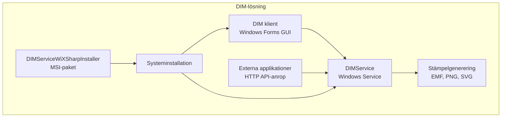

# DIM - Digital Informationsmarkering

## Översikt

DIM (Digital Informationsmarkering) är en komplett lösning för att skapa digitala säkerhetsstämplar för dokumentklassificering enligt svenska offentlighets- och sekretesslagen (OSL). Lösningen består av tre sammanhängande komponenter som tillsammans tillhandahåller både automatiserad API-baserad och manuell stämpelgenerering.

### Systemkomponenter

```
DIM-lösningen/
├── DIMService/                    - Windows Service med HTTP API
├── DIM/                          - Windows Forms GUI-klient
└── DIMServiceWiXSharpInstaller/  - MSI-installationspaket
```

## Lösningsarkitektur

### Komponentöversikt



### Teknisk Stack

- **Framework**: .NET 8.0 (Windows-specifik)
- **Arkitektur**: Service-oriented med HTTP API och GUI-klient
- **Bildhantering**: System.Drawing.Common, SVG.NET
- **Installation**: WiX Sharp för MSI-paket
- **Hosting**: Microsoft.Extensions.Hosting.WindowsServices
- **Konfiguration**: JSON-baserad med hot-reload-stöd

## Komponentbeskrivning

## 1. DIMService - Stämpelgenereringstjänst

### Syfte
Windows Service som tillhandahåller HTTP-baserade API:er för automatiserad stämpelgenerering. Huvudkomponenten i lösningen som hanterar all stämpellogik.

### Arkitektur
```
DIMService/
├── Program.cs              - Applikationens startpunkt och värdkonfiguration
├── Worker.cs               - Bakgrundstjänstlogik och infrastrukturhantering
├── HttpServer.cs           - HTTP-server och API-endpoints
├── KonfigData.cs           - Konfigurationsdatastrukturer
├── KonfigHanterare.cs      - Konfigurationshantering
├── Repository.cs           - Globala konstanter och sökvägar
├── StampelInfo.cs          - Stämpeldatastruktur
├── StampelRetur.cs         - Stämpelreturstruktur
├── ErrorLog.cs             - Loggningshantering
└── Json/
    └── config DIMService.json - Standardkonfiguration
```

### Funktionalitet
- **HTTP API-server**: Lyssnar på konfigurerad port (standard: 8080)
- **Stämpelgenerering**: Stödjer EMF, PNG och SVG-format
- **Sekretessklassificering**: Implementerar OSL-kompatibla klassificeringar
- **Metadata-hantering**: Inbäddning av dokumentspårbarhet
- **Konfigurationshantering**: Hot-reload av JSON-konfiguration
- **Loggning**: EventLog och filbaserad felhantering

### Filsystemsstruktur
```
%ALLUSERSPROFILE%/DIM/
├── Config/         - Konfigurationsfiler för båda applikationer
├── Temp/          - Temporära stämpelfiler från DIMService
└── Fellogg/       - Felloggar från DIMService
```

## 2. DIM - GUI-klient

### Syfte
Windows Forms-applikation som tillhandahåller ett användarvänligt grafiskt gränssnitt för manuell stämpelgenerering. Konsumerar DIMService:s API:er via HTTP-anrop.

### Arkitektur
```
DIM/
├── Program.cs              - Applikationsstartpunkt och HTTP-kommunikation
├── MainForm.cs/Designer.cs - Huvudformulär och UI-logik
├── KonfigData.cs           - Konfigurationsdatastruktur (förenklad)
├── KonfigHanterare.cs      - Konfigurationshantering för klienten
├── Repository.cs           - Gemensamma funktioner och konstanter
├── ClipboardMetafile.cs    - Urklippshantering för vektorbilder
├── ErrorResponse.cs        - Felhantering från service-anrop
├── DIMServiceException.cs  - Specialiserad felklass
└── Json/
    └── config DIM.json     - Klientkonfiguration
```

### Funktionalitet
- **Service-kommunikation**: Verifierar DIMService-tillgänglighet vid start
- **Interaktiv stämpelgenerering**: Steg-för-steg-guidning för användare
- **Förhandsvisning**: Visar genererade stämplar i realtid
- **Formathantering**: Stöder alla DIMService-format med konvertering
- **Konfigurationssynkronisering**: Hämtar aktuella inställningar från service
- **Felhantering**: Användarvänlig visning av service-fel

### Användargränssnitt
- **Sekretessval**: Dropdown för sekretessklassificering (Hemlig, SK, etc.)
- **Paragrafval**: Checkboxar för tillämpliga OSL-paragrafer
- **Dimensionering**: Anpassningsbara stämpelstorlekar med proportionslåsning
- **Förhandsvisning**: Visar stämpel före export
- **Export**: Spara till fil eller kopiera till urklipp

### Teknisk Implementation
- **HTTP-klient**: Asynkron kommunikation med DIMService
- **SVG-hantering**: Konvertering till Metafile för Windows-kompatibilitet
- **Urklippsintegration**: Metafile-support för vektorbilder
- **Skalning**: Automatisk proportionsberäkning för olika format

## 3. DIMServiceWiXSharpInstaller - MSI-installationspaket

### Syfte
Skapar ett professionellt MSI-installationspaket som installerar både DIMService som Windows Service och DIM-klienten med alla nödvändiga komponenter.

### Installation Components
```
MSI-paket innehåller:
├── DIMService/
│   ├── Windows Service-installation med NetworkService-konto
│   ├── Automatisk start vid systemstart
│   └── Komplett runtime-paket (.NET 8.0)
├── DIM/
│   ├── GUI-applikation
│   ├── Skrivbordsgenväg
│   └── Startmeny-genväg
├── Konfigurationsfiler/
│   ├── config DIMService.json (i ProgramData)
│   └── config DIM.json (i ProgramData)
└── Dependencies/
    ├── .NET 8.0 runtime-komponenter
    └── Windows-specifika bibliotek
```

### Funktionalitet
- **Versionhantering**: Automatisk versionsdetektering från DIMService.exe
- **Uppgraderingslogik**: Major upgrade-support för säkra uppdateringar
- **Service-installation**: Automatisk registrering som Windows Service
- **Rättighetskonfiguration**: NetworkService-konto för säker drift
- **Avinstallation**: Komplett borttagning inklusive service-avregistrering

### Build-process
```xml
<Target Name="PostBuild" AfterTargets="PostBuildEvent">
  <Exec Command="$(TargetPath)" />
</Target>
```
- **Automatisk byggnation**: Genererar MSI direkt efter build
- **Dependency-detection**: Inkluderar alla required runtime-komponenter
- **Versionerade filer**: MSI-namn inkluderar versionsnummer

## API-Dokumentation

### HTTP API (DIMService)

#### Bas-URL
`http://localhost:[konfigurerad port]/` (standard: 8080)

#### Administrativa Endpoints

##### `/isrunning`
- **Metod**: GET
- **Syfte**: Hälsokontroll för tjänsten
- **Svar**: `"true"` som plaintext

##### `/config`
- **Metod**: GET
- **Syfte**: Returnerar aktuell konfiguration
- **Svar**: JSON-objekt med komplett konfiguration

#### Informationsendpoints

##### `/fellogg` / `/felloggtext`
- **Metod**: GET
- **Syfte**: Hämtar senaste felloggar
- **Svar**: JSON-array eller formaterad text

##### `/format` / `/formattext`
- **Metod**: GET
- **Syfte**: Listar tillgängliga bildformat
- **Svar**: JSON-array eller text med formatinformation

##### `/paragrafer` / `/paragrafertext`
- **Metod**: GET
- **Parametrar**: `sekretess` (obligatorisk)
- **Syfte**: Hämtar paragrafer för angiven sekretessnivå
- **Svar**: JSON-array eller text med paragrafdata

##### `/ssk` / `/ssktext`
- **Metod**: GET
- **Parametrar**: `sekretess` (standard: "Hemlig")
- **Syfte**: Hämtar säkerhetsskyddsklasser
- **Svar**: JSON-array eller text med SSK-data

#### Stämpelgenereringsendpoints

##### `/stampel` / `/stampelurl`
- **Metod**: GET
- **Syfte**: Genererar kompletta säkerhetsstämplar

**Obligatoriska parametrar**:
- `sekretess`: Sekretesskod (t.ex. "Hemlig", "SK")
- `paragrafer`: Kommaseparerade paragrafkoder
- `ssk`: Säkerhetsskyddsklassifikation (för SK-sekretess)

**Valfria parametrar**:
- `datum`: Datum (standard: dagens datum)
- `bredd`, `hojd`: Stämpelstorlek i pixlar
- `format`: Bildformat ("emf", "png", "svg")
- `orientering`: "h" eller "v"
- `vhtnamn`: Verksamhetsnamn

##### `/stampelhanvisning` / `/stampelhanvisningurl`
- **Metod**: GET
- **Syfte**: Genererar hänvisningsstämplar för flersidiga dokument
- **Parametrar**: `ssk` (obligatorisk), samt storlek och format

## Stämpelgenereringsprocess

### Teknisk Implementation

#### Vektorbaserad Rendering (EMF/SVG)
1. **EMF-generering**: Windows GDI+ Metafile-API
2. **SVG-generering**: SVG.NET-biblioteket med XML-export
3. **Renderingspipeline**: Gemensam textlayout och färghantering

#### Rasterbild-rendering (PNG)
1. Genererar EMF-vektorbild först
2. Renderar till Bitmap med anti-aliasing
3. Exporterar som PNG med optimal komprimering

#### Metadata-hantering
**PNG-metadata** (iTXt-chunks):
- `data-creator`, `data-title`, `data-description`
- `data-created`, `data-query`

**EMF-metadata** (Comment Records):
- XML-formaterad metadata i EMF-kommentarer
- XMP-metadata för verktygskompatibilitet

**SVG-metadata** (Standard-element):
- Dublin Core-metadata
- W3C-kompatibel metadatastruktur

### Stämpeltyper

#### HEMLIG-stämplar
- Rubrik med horisontellt streck
- Paragraftext under strecket
- Datum och verksamhetsinformation
- Röd färg (#ED1C24)

#### SK-stämplar (Säkerhetsskyddad)
- Paragraftext överst
- Sekretessklassificering med SSK
- Samma färgschema och layout

#### Hänvisningsstämplar
- Kompakt format för flersidiga dokument
- SSK-klassificering med "Se sid 1"-hänvisning

## Konfigurationshantering

### Gemensam Konfigurationsstruktur
Både DIM och DIMService använder JSON-baserad konfiguration lagrad i `%ALLUSERSPROFILE%\DIM\Config\`:

#### DIMService-konfiguration
```json
{
  "Lyssnarport": 8080,
  "Format": [...],
  "Sekretess": [...],
  "Defaultvarden": [...]
}
```

#### DIM-klientkonfiguration
```json
{
  "Lyssnarport": 8080,
  "ServiceURL": "//localhost"
}
```

### Hot-reload-stöd
- **DIMService**: Automatisk detektering av konfigurationsändringar
- **DIM-klient**: Laddar om konfiguration vid nästa start
- **Synkronisering**: Klient hämtar aktuella värden från service

## Installation och Deployment

### Systemkrav
- **OS**: Windows 10/11 eller Windows Server 2019+
- **Framework**: .NET 8.0 Runtime (inkluderas i MSI)
- **Privilegier**: Administratörsbehörighet för installation
- **Git**: Krävs för automatisk versionering vid build

### Installationsprocess
1. **MSI-körning**: Dubbelklick på DIM_[version].msi
2. **Service-installation**: DIMService registreras automatiskt
3. **Klientinstallation**: DIM-applikation med genvägar
4. **Konfiguration**: Standardfiler kopieras till ProgramData
5. **Service-start**: DIMService startar automatiskt

### Build och Distribution

#### Automatisk Versionering
Alla projekt använder Git-baserad versionering:
```xml
<Target Name="GetGitCommitCount" BeforeTargets="GetAssemblyVersion">
  <Exec Command="git rev-list --count HEAD">
    <Output TaskParameter="ConsoleOutput" PropertyName="GitCommitCount" />
  </Exec>
  <PropertyGroup>
    <Version>$(VersionPrefix).$(GitCommitCount)</Version>
  </PropertyGroup>
</Target>
```

#### Build-sekvens
1. **DIMService**: Bygg och publicera för win-x64
2. **DIM**: Bygg och publicera för win-x64
3. **Installer**: Skapa MSI med versionerade komponenter

## Säkerhet och Compliance

### Säkerhetsaspekter
- **Nätverksbindning**: Endast localhost-anslutningar
- **Service-konto**: NetworkService för minimal systemåtkomst
- **API-begränsning**: Endast GET-requests, ingen autentisering
- **Filbehörigheter**: Begränsade skrivrättigheter till ProgramData

### Compliance
- **OSL-efterlevnad**: Implementerar svenska offentlighets- och sekretesslagen
- **Standardiserad klassificering**: Förutsatta sekretessklasser och paragrafer
- **Dokumentspårbarhet**: Metadata för alla genererade stämplar
- **Arkivering**: Temporära filer för revisionsändamål

## Felsökning och Underhåll

### Vanliga Problem

#### DIMService
1. **Port upptagen**: Ändra `Lyssnarport` i konfiguration
2. **Service startar inte**: Kontrollera EventLog för fel
3. **API ej tillgängligt**: Verifiera Windows Firewall-inställningar

#### DIM-klient
1. **"Kunde inte hitta servicen"**: Kontrollera att DIMService körs
2. **Konfigurationsfel**: Verifiera JSON-syntax i config-filer
3. **Stämpel visas ej**: Kontrollera bildformat-kompatibilitet

#### Installer
1. **MSI-byggnation misslyckas**: Kontrollera att DIMService och DIM är byggda
2. **Versionering misslyckas**: Verifiera Git-tillgänglighet i PATH
3. **Installation misslyckas**: Kör som administratör

### Loggning
- **DIMService EventLog**: Systemfel och viktiga händelser
- **DIMService Fellogg**: JSON-baserad detaljerad felspårning
- **DIM-klient**: Visar service-fel i användargränssnittet
- **MSI-installation**: Windows Installer-loggar

### Prestanda
- **Minneshantering**: Automatisk cleanup av temporära filer
- **Samtidiga requests**: Asynkron hantering utan blocking
- **GUI-responsivitet**: Asynkron service-kommunikation
- **Bildoptimering**: Vektorrendering före rasterkonvertering

## Framtida Utveckling

### Planerade Förbättringar
1. **Webbaserad klient**: Modern webbgränssnitt som komplement till WinForms
2. **REST API-expansion**: Stöd för POST-requests och JSON-payloads
3. **Autentisering**: JWT eller API-key-baserad säkerhet
4. **Databas-integration**: Persistering av stämpelhistorik
5. **Bulk-processing**: Batch-generering av stämplar

### Teknisk Modernisering
1. **Cross-platform**: Migration till .NET Core för Linux-support
2. **Containerisering**: Docker-support för enklare deployment
3. **Cloud-integration**: Azure/AWS-deployment-alternativ
4. **API-dokumentation**: OpenAPI/Swagger-specifikation
5. **Enhetstester**: Utökad testning av alla komponenter

### Arkitektoniska Förbättringar
1. **Microservices**: Uppdelning av funktionalitet
2. **Message queuing**: Asynkron stämpelbearbetning
3. **Load balancing**: Stöd för flera service-instanser
4. **Centraliserad konfiguration**: Delad konfigurationshantering
5. **Monitoring**: Applikationsövervakning och metrics

## Tekniska Begränsningar

### Plattformsbegränsningar
- **Windows-specifik**: System.Drawing.Common och Windows Services
- **GDI+-beroende**: EMF-generering kräver Windows GDI+
- **WinForms-GUI**: Endast Windows desktop-support

### Funktionella Begränsningar
- **Lokal kommunikation**: Endast localhost HTTP-binding
- **Synkron GUI**: WinForms-begränsningar för asynkron UI
- **Statisk konfiguration**: Vissa inställningar kräver omstart
- **Minnesintensiv**: Bildgenerering håller data i minnet

### Skalbarhetsbegränsningar
- **Single-instance**: Endast en DIMService per maskin
- **Filsystemsberoende**: Begränsad av diskprestanda
- **HTTP listener**: Begränsad till HttpListener-kapacitet
- **GUI-prestanda**: WinForms-begränsningar för stora bilder
