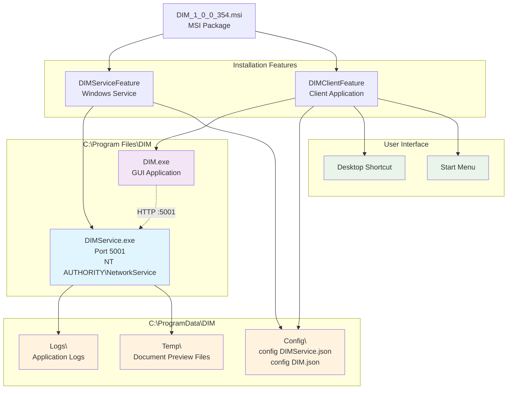
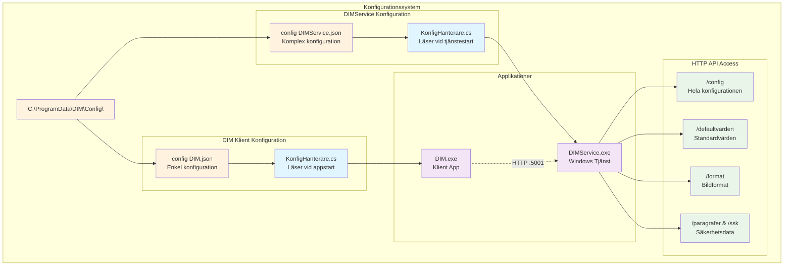
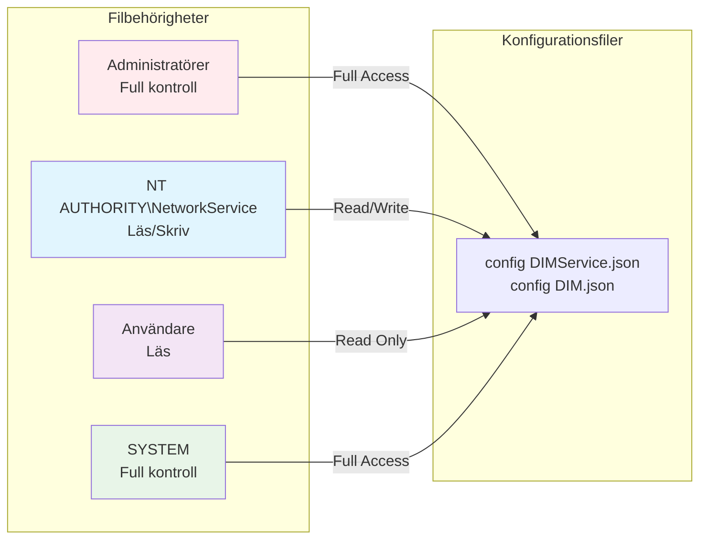

# DIM - Komplett Teknikerguide
## Digital Informationsmarkering - Fullständig teknisk dokumentation


### Dokumentversion
- **Version:** 1.0
- **Datum:** 2025-01-25
- **Målgrupp:** Tekniker och systemadministratörer
- **Syfte:** Komplett guide för installation, konfiguration, drift och underhåll av DIM-systemet

---

## Innehållsförteckning

### Del I - Översikt och snabbstart
- [1. Systemöversikt](#1-systemöversikt)
- [2. Snabb installation](#2-snabb-installation)
- [3. Grundläggande drift](#3-grundläggande-drift)
- [4. Vanlig felsökning](#4-vanlig-felsökning)

### Del II - MSI-installation och deployment  
- [5. Detaljerad MSI-installation](#5-detaljerad-msi-installation)
- [6. Systemkrav och komponenter](#6-systemkrav-och-komponenter)
- [7. Avancerad installation](#7-avancerad-installation)
- [8. Uppgraderingar och avinstallation](#8-uppgraderingar-och-avinstallation)

### Del III - Konfigurationshantering
- [9. Konfigurationsarkitektur](#9-konfigurationsarkitektur)
- [10. DIMService konfiguration](#10-dimservice-konfiguration)
- [11. Klientkonfiguration](#11-klientkonfiguration)
- [12. Säkerhetsklassificeringar](#12-säkerhetsklassificeringar)

### Del IV - HTTP API och övervakning
- [13. HTTP API översikt](#13-http-api-översikt)
- [14. Systemövervakning](#14-systemövervakning)
- [15. Diagnostik och felsökning](#15-diagnostik-och-felsökning)

### Del V - Support och underhåll
- [16. Prestanda och optimering](#16-prestanda-och-optimering)
- [17. Säkerhet och compliance](#17-säkerhet-och-compliance)
- [18. Support och vidare läsning](#18-support-och-vidare-läsning)

---

# Del I - Översikt och snabbstart

## 1. Systemöversikt

DIM (Digital Informationsmarkering) är ett system för att skapa digitala säkerhetsstämplar för klassificering av dokument enligt svenska offentlighets- och sekretesslagen (OSL). Systemet är utvecklat för att möta svenska myndigheters behov av säker och standardiserad dokumentmarkering.

### 1.1 Vad gör DIM?

DIM tillhandahåller en komplett lösning för att:
- **Klassificera dokument** enligt säkerhetsnivåer som "Hemlig", "Säkerhetsskyddsklassificerad (SK)" etc.
- **Skapa standardiserade stämplar** som följer juridiska krav för informationshantering
- **Märka dokument** med korrekta hänvisningar till relevanta paragrafer i OSL
- **Säkerställa spårbarhet** genom metadata i alla genererade markeringar

### 1.2 Målgrupp för denna dokumentation

Denna guide är **riktad till tekniker** som ansvarar för:
- ✅ Installation av DIM-systemet
- ✅ Konfiguration av tjänster och inställningar  
- ✅ Drift och underhåll av systemet
- ✅ Felsökning av tekniska problem
- ✅ Avinstallation vid behov

### 1.3 Systemkomponenter

DIM består av två huvudkomponenter som levereras tillsammans i ett MSI-installationspaket:

#### 1.3.1 DIMService (Windows-tjänst)
- **Funktion:** Backend-tjänst som hanterar stämpelgenerering
- **Typ:** Windows Service som körs automatiskt
- **Kommunikation:** HTTP API på konfigurerad port (standard: 5001)
- **Användarkonto:** NT AUTHORITY\NetworkService
- **Placering:** `C:\Program Files\DIM\DIMService\`

#### 1.3.2 DIM (Klientapplikation)
- **Funktion:** Grafiskt användargränssnitt för manuell stämpelgenerering
- **Typ:** Windows Forms-applikation  
- **Kommunikation:** Ansluter till DIMService via HTTP
- **Användare:** Alla som behöver skapa dokumentstämplar
- **Placering:** `C:\Program Files\DIM\DIM\`

#### 1.3.3 Systemarkitektur
```
[DIM Klient] ←→ HTTP (port 5001) ←→ [DIMService] → [Stämpelfiler]
     ↓                                      ↓
[Användargränssnitt]                [Konfigurationsfiler]
```

---

## 2. Snabb installation

### 2.1 Systemkrav (snabböversikt)
- **Operativsystem:** Windows 10 eller Windows 11 (x64)
- **Behörigheter:** Administratörsbehörighet för installation
- **Nätverk:** Port 5001 TCP måste vara tillgänglig lokalt
- **Diskutrymme:** Minst 200 MB ledigt utrymme

### 2.2 Leveransformat
DIM levereras som en MSI-fil med namnet: `DIM_[version].msi`

Exempel: `DIM_1_0_0_354.msi`

### 2.3 Standardinstallation (rekommenderat)
1. Högerklicka på MSI-filen och välj "Kör som administratör"
2. Följ installationsguiden
3. Både DIMService och DIM-klient installeras automatiskt
4. DIMService-tjänsten startas automatiskt
5. Genväg för DIM-klient skapas på skrivbordet

### 2.4 Verifiering av installation
**Kontrollera att systemet fungerar:**
1. **Tjänststatus:** Öppna `services.msc` och verifiera att "DIMService" körs
2. **HTTP-API:** Öppna webbläsare och gå till `http://localhost:5001/isrunning` (ska visa `true`)
3. **Klienttest:** Dubbelklicka på DIM-genvägen på skrivbordet

---

## 3. Grundläggande drift

### 3.1 Konfigurationsfiler
Alla konfigurationsfiler placeras i: `C:\ProgramData\DIM\Config\`

- **`config DIMService.json`** - Tjänstens huvudkonfiguration
- **`config DIM.json`** - Klientens anslutningsinställningar

### 3.2 Arbetskataloger
- **`C:\ProgramData\DIM\Logs\`** - Felloggar och händelseloggar
- **`C:\ProgramData\DIM\Temp\`** - Temporära filer för dokumentvisning

### 3.3 Tjänsthantering
DIMService kan hanteras via Windows Tjänster:
- **Tjänstnamn:** DIMService
- **Starttyp:** Automatisk
- **Inloggning som:** NT AUTHORITY\NetworkService

### 3.4 Kontroll av systemstatus
- **Tjänststatus:** Via Windows Tjänster eller `services.msc`
- **HTTP-tillgänglighet:** `http://localhost:5001/isrunning`
- **Klientanslutning:** Starta DIM-applikationen - den visar anslutningsstatus

---

## 4. Vanlig felsökning

### 4.1 DIMService startar inte
1. Kontrollera Windows Event Log för felmeddelanden
2. Verifiera att port 5001 inte används av annan tjänst
3. Kontrollera behörigheter för NetworkService-kontot

### 4.2 DIM-klient kan inte ansluta
1. Verifiera att DIMService-tjänsten körs
2. Kontrollera brandväggsinställningar för port 5001
3. Validera konfigurationen i `config DIM.json`

### 4.3 Konfigurationsfel
1. Kontrollera JSON-syntax i konfigurationsfilerna
2. Jämför med standardkonfigurationer
3. Starta om DIMService efter konfigurationsändringar

### 4.4 Loggfiler
- **Windows Event Log:** Systemfel och viktiga händelser
- **`C:\ProgramData\DIM\Logs\`** - Detaljerade felloggar från DIMService
- **HTTP API:** `http://localhost:5001/fellogg` - Realtidsloggar via API

### 4.5 Avinstallation (snabb)

#### Via kontrollpanelen
1. Öppna "Program och funktioner" i Kontrollpanelen
2. Hitta "DIM" i listan
3. Högerklicka och välj "Avinstallera"
4. Följ avinstallationsguiden

#### Via MSI (administratör)
```cmd
msiexec /x DIM_1_0_0_354.msi /qn
```

---

# Del II - MSI-installation och deployment

## 5. Detaljerad MSI-installation

### 5.1 Varför levereras DIM som MSI-paket?

DIM levereras som en Windows Installer-fil (`.msi`) för professionell enterprise-deployment:

**🔧 Fördelar med MSI för tekniker:**
- **Windows-standard** för företagsapplikationer
- **Automatisk registrering** av tjänster och komponenter
- **Korrekt filbehörigheter** sätts automatiskt
- **Windows Add/Remove Programs** integration
- **Silent installation** för massutrollning
- **Feature-baserad installation** - välj endast nödvändiga komponenter
- **Automatisk uppgradering** med major upgrade-logik
- **Ren avinstallation** - inga kvarvarande filer

### 5.2 Systemöversikt och installationsprocess

MSI-paketet innehåller allt som behövs för en komplett installation, med möjlighet att välja specifika komponenter genom "features":



## 6. Systemkrav och komponenter

### 6.1 Systemkrav
- **Operativsystem:** Windows 10 eller Windows 11 (x64)
- **Behörigheter:** Administratörsbehörighet för installation
- **Nätverk:** Port 5001 TCP måste vara tillgänglig lokalt
- **Diskutrymme:** Minst 200 MB ledigt utrymme

### 6.2 Systemkomponenter
DIM består av två huvudkomponenter som levereras tillsammans i ett MSI-installationspaket:

#### 6.2.1 DIMService (Windows-tjänst)
- **Funktion:** Backend-tjänst som hanterar stämpelgenerering
- **Typ:** Windows Service som körs automatiskt
- **Kommunikation:** HTTP API på konfigurerad port (standard: 5001)
- **Användarkonto:** NT AUTHORITY\NetworkService
- **Placering:** `C:\Program Files\DIM\DIMService\`

#### 6.2.2 DIM (Klientapplikation)
- **Funktion:** Grafiskt användargränssnitt för manuell stämpelgenerering
- **Typ:** Windows Forms-applikation  
- **Kommunikation:** Ansluter till DIMService via HTTP
- **Användare:** Alla som behöver skapa dokumentstämplar
- **Placering:** `C:\Program Files\DIM\DIM\`

## 7. Avancerad installation

### 7.1 Systemöversikt och installationsprocess
MSI-paketet innehåller allt som behövs för en komplett installation, med möjlighet att välja specifika komponenter genom "features":


## 8. Uppgraderingar och avinstallation

### 8.1 Uppgraderingar
- **Automatisk uppgradering** - DIMService och DIM-klienten uppgraderas automatiskt vid nästa installation

### 8.2 Avinstallation

#### Via kontrollpanelen
1. Öppna "Program och funktioner" i Kontrollpanelen
2. Hitta "DIM" i listan
3. Högerklicka och välj "Avinstallera"
4. Följ avinstallationsguiden

#### Via MSI (administratör)
```cmd
msiexec /x DIM_1_0_0_354.msi /qn
``` 

---

# Del III - Konfigurationshantering

## 9. Konfigurationsarkitektur

### 9.1 Varför finns konfigurationsfilerna?

**För dig som tekniker:** Konfigurationsfilerna är **hjärtat i DIM-systemets funktion**. De bestämmer inte bara hur systemet fungerar, utan även om det fungerar överhuvudtaget. Utan korrekt konfiguration startar varken DIMService eller DIM-klienten.

#### 9.1.1 Kritiska funktioner som konfigurationsfilerna fyller:

**🔒 Säkerhet - Regelefterlevnad och klassificering**
- **Vad det innebär:** Säkerhetsklassificeringar (Hemlig, SK, etc.) och paragrafkopplingar definieras i konfigurationen
- **Praktiskt exempel:** När OSL-lagstiftningen ändras kan du uppdatera paragrafkopplingar utan systemomstart
- **Som tekniker:** Du ansvarar för att säkerhetsklassificeringarna följer aktuell lagstiftning

**📈 Skalbarhet - Ändringar utan kodmodifikationer**
- **Vad det innebär:** Systemet kan växa och anpassas utan att kräva nya programversioner
- **Praktiskt exempel:** Lägg till nya bildformat, ändra standardstorlekar, konfigurera för fjärrservrar
- **Som tekniker:** Du kan göra förändringar direkt i produktionsmiljön (med försiktighet)

**📋 Standardisering - Konsekvent beteende**
- **Vad det innebär:** Alla användare får samma standardinställningar och beteenden
- **Praktiskt exempel:** Alla stämplar får samma storlek, färg och format inom organisationen

**⚖️ Compliance - Juridisk efterlevnad**
- **Vad det innebär:** Systemet måste följa svenska offentlighets- och sekretesslagen (OSL)
- **Praktiskt exempel:** Korrekta paragrafkopplingar, rätt formuleringar, godkända klassificeringar

### 9.2 Konfigurationsarkitektur



### 9.3 Konfigurationsfilernas placering

| Fil | Fullständig sökväg | Beskrivning |
|-----|-------------------|-------------|
| **DIMService config** | `C:\ProgramData\DIM\Config\config DIMService.json` | Tjänstens huvudkonfiguration |
| **DIM klient config** | `C:\ProgramData\DIM\Config\config DIM.json` | Klientens anslutningsinställningar |

### 9.4 Filbehörigheter



---

## 10. DIMService konfiguration

### 10.1 Övergripande struktur

**Fil:** `config DIMService.json`

```json
{
  "Lyssnarport": 5001,
  "Defaultvarden": [...],
  "Format": [...],
  "Sekretess": [...]
}
```

### 10.2 Lyssnarport

**Funktion:** Definierar vilken port HTTP-servern lyssnar på

```json
"Lyssnarport": 5001
```

**Tekniska detaljer:**
- **Datatyp:** `int`
- **Standardvärde:** `5001`
- **Användning:** `http://localhost:5001/`
- **Validering:** Måste vara ledig port (1024-65535)

**Påverkan vid ändring:**
- Kräver omstart av DIMService-tjänsten
- Alla klienter måste uppdatera sin `config DIM.json`
- Brandväggsinställningar kan behöva justeras

### 10.3 Defaultvärden

**Funktion:** Standardinställningar för dokumentmarkering

```json
"Defaultvarden": [
  {
    "Kod": "VerksamhetNamn",
    "Text": "Statens Fastighetsverk\r\n(SFV)",
    "Varde": 0
  },
  {
    "Kod": "Format",
    "Text": "svg",
    "Varde": 0
  },
  {
    "Kod": "Bredd",
    "Text": "",
    "Varde": 302
  },
  {
    "Kod": "Hojd", 
    "Text": "",
    "Varde": 182
  }
]
```

**Tillgängliga standardvärden:**

| Kod | Beskrivning | Datatyp | Exempel |
|-----|-------------|---------|---------|
| `VerksamhetNamn` | Organisationsnamn | Text | "Statens Fastighetsverk\r\n(SFV)" |
| `Format` | Standardbildformat | Text | "svg", "png", "emf" |
| `Bredd` | Stämpelbredd (pixlar) | Numerisk | 302 |
| `Hojd` | Stämpelhöjd (pixlar) | Numerisk | 182 |
| `BreddHanvisning` | Hänvisningsbredd | Numerisk | 302 |
| `HojdHanvisning` | Hänvisningshöjd | Numerisk | 66 |

### 10.4 Format

**Funktion:** Definierar tillgängliga bildformat för exportering

```json
"Format": [
  {
    "Kod": "emf",
    "Text": "emf",
    "Beskrivning": "Metafil"
  },
  {
    "Kod": "png",
    "Text": "png", 
    "Beskrivning": "Rasterfil"
  },
  {
    "Kod": "svg",
    "Text": "svg",
    "Beskrivning": "Vektorfil"
  }
]
```

**Formatdetaljer:**

| Format | Beskrivning | Användning | Tekniska egenskaper |
|--------|-------------|------------|-------------------|
| **EMF** | Enhanced Metafile | Windows-dokument | Vektor, skalbar, metadata-stöd |
| **PNG** | Portable Network Graphics | Webben, presentationer | Raster, transparent bakgrund |
| **SVG** | Scalable Vector Graphics | Modern webb, print | XML-baserad, fullt skalbar |

---

## 11. Klientkonfiguration

### 11.1 DIM klient konfigurationsfil

**Fil:** `config DIM.json`

```json
{
  "Lyssnarport": 5001
}
```

**Enkel konfiguration:** Klientkonfigurationen innehåller endast porten för anslutning till DIMService.

**Tekniska detaljer:**
- **Syfte:** Anger vilken port DIM-klienten ska använda för att ansluta till DIMService
- **Synkronisering:** Måste matcha `Lyssnarport` i `config DIMService.json`
- **Ändring:** Kräver omstart av DIM-klientapplikationen

---

## 12. Säkerhetsklassificeringar

### 12.1 Sekretess (Huvudsektion)

**Funktion:** Definierar säkerhetsklassificeringar enligt svensk lagstiftning

```json
"Sekretess": [
  {
    "Kod": "Ö",
    "Text": "EJ SEKRETESS",
    "HarParagrafer": false,
    "HarSSK": false
  },
  {
    "Kod": "Hemlig",
    "Text": "HEMLIG", 
    "HarParagrafer": true,
    "HarSSK": true,
    "Paragrafer": [...],
    "SSK": [...]
  },
  {
    "Kod": "SK",
    "Text": "SEKRETESS-\r\nKLASSIFICERAD",
    "HarParagrafer": true,
    "HarSSK": false,
    "Paragrafer": [...]
  }
]
```

**Tillgängliga sekretessklassificeringar:**

| Kod | Klassificering | Har Paragrafer | Har SSK | Användning |
|-----|---------------|---------------|---------|------------|
| **Ö** | EJ SEKRETESS | Nej | Nej | Öppen information |
| **Hemlig** | HEMLIG | Ja | Ja | Säkerhetsskyddsklassad information |
| **SK** | SEKRETESS-KLASSIFICERAD | Ja | Nej | Sekretessbelagd utan SSK |

### 12.2 Paragrafer

**Funktion:** Juridiska grunder för sekretessklassificering enligt Offentlighets- och sekretesslagen

```json
"Paragrafer": [
  {
    "Kod": "P15K1",
    "Text": "15 kap. 1 §",
    "Beskrivning": "Utrikessekretess"
  },
  {
    "Kod": "P15K2", 
    "Text": "15 kap. 2 §",
    "Beskrivning": "Försvarssekretess"
  }
]
```

**Tillgängliga paragrafer:**

| Kod | Paragraf | Beskrivning | Tillämpningsområde |
|-----|----------|-------------|-------------------|
| `P15K1` | 15 kap. 1 § | Utrikessekretess | Utrikesrelationer, diplomati |
| `P15K2` | 15 kap. 2 § | Försvarssekretess | Militära frågor, försvar |
| `P18K8` | 18 kap. 8 § | Säkerhets-eller bevakningsåtgärd | Säkerhetsskydd |
| `P18K8a` | 18 kap. 8a § | Incidentrapporter | Säkerhetsincidenter |
| `P18K9` | 18 kap. 9 § | Chiffer kod m.m. | Kryptografi, kodning |
| `P39K1` | 39 kap. 1 § | Personalsocial verksamhet | Personalfrågor |
| `P39K2` | 39 kap. 2 § | Personaladministrativ verksamhet i övrigt | HR-administration |
| `P39K3` | 39 kap. 3 § | Adresser telefonnummer m.m. | Personuppgifter |

### 12.3 SSK (Säkerhetsskyddsklass)

**Funktion:** Definierar säkerhetsskyddsklassificering för hemlig information

```json
"SSK": [
  {
    "Kod": "BH",
    "Text": "Begränsat Hemlig"
  },
  {
    "Kod": "K", 
    "Text": "Konfidentiell"
  },
  {
    "Kod": "H",
    "Text": "Hemlig"
  },
  {
    "Kod": "KH",
    "Text": "Kvalificerat Hemlig"
  }
]
```

**SSK-nivåer:**

| Kod | Klassificering | Säkerhetsnivå | Användning |
|-----|---------------|---------------|------------|
| **BH** | Begränsat Hemlig | Lägsta hemliga nivån | Begränsad spridning |
| **K** | Konfidentiell | Medel | Konfidentiell information |
| **H** | Hemlig | Hög | Hemlig information |
| **KH** | Kvalificerat Hemlig | Högsta nivån | Mycket känslig information |

---

# Del IV - HTTP API och övervakning

## 13. HTTP API översikt

### 13.1 Vad är DIM HTTP API?

**Systemets HTTP-gränssnitt:**
DIMService exponerar ett HTTP API på port 5001 (konfigurerbart) som tillhandahåller access till systemets interna status, konfiguration och funktionalitet. Detta API är **inte** avsett för slutanvändare utan för **teknisk diagnostik och systemintegration**.

#### 13.1.1 Varför är HTTP API:et viktigt för tekniker?

**🔍 Systemövervakning och diagnostik:**
- **Realtidsstatus** - Kontrollera om tjänsten svarar
- **Felloggar** - Hämta aktuella felmeddelanden direkt från systemet
- **Konfigurationskontroll** - Verifiera att inställningar laddats korrekt
- **Funktionalitettest** - Testa stämpelgenerering utan GUI

**🛠️ Praktiska fördelar för drift:**
- **Skriptbar övervakning** - Automatisera hälsokontroller
- **Fjärrdiagnostik** - Felsök från annan maskin (med rätt nätverksinställningar)
- **Integrationstestning** - Verifiera att systemet fungerar som förväntat
- **Snabb problemlösning** - Direkt access till system-status utan GUI

### 13.2 Bas-URL och åtkomst

**Standard HTTP-adress:**
```
http://localhost:5001/
```

**Viktiga tekniska detaljer:**
- **Port:** Konfigurerbar via `Lyssnarport` i `config DIMService.json`
- **Protokoll:** HTTP endast (inte HTTPS)
- **Metoder:** Endast GET-requests stöds
- **Encoding:** UTF-8 för alla svar
- **CORS:** Aktiverat för cross-origin requests

#### 13.2.1 Testning av åtkomst:

**🌐 Via webbläsare:**
```
http://localhost:5001/isrunning
```
Svar: `true` (om tjänsten körs)

**💻 Via PowerShell:**
```powershell
Invoke-RestMethod -Uri "http://localhost:5001/isrunning"
```

**🔧 Via curl (om installerat):**
```cmd
curl http://localhost:5001/isrunning
```

### 13.3 Endpoint-kategorier

**För strukturerad förståelse** är endpoints indelade i tre huvudkategorier:

#### 🚦 Systemstatus och övervakning
- Kontrollera tjänstestatus
- Hämta felloggar för diagnostik
- Övervaka systemhälsa

#### ⚙️ Konfigurationsinformation  
- Verifiera laddad konfiguration
- Kontrollera standardvärden
- Validera säkerhetsklassificeringar

#### 🏷️ Stämpelgenerering
- Testa stämpelfunktionalitet
- Generera test-stämplar
- Validera bildformat

## 14. Systemövervakning

**Kritiska endpoints för daglig drift:** Dessa endpoints hjälper dig övervaka systemets hälsa och identifiera problem snabbt.

### 14.1 `/isrunning` - Tjänstestatus

**Syfte:** Enklaste sättet att kontrollera om DIMService körs och svarar på HTTP-requests.

**URL:** `http://localhost:5001/isrunning`
**Metod:** GET
**Parametrar:** Inga

#### Svar:
```
true
```

#### Användning för tekniker:

**✅ Framgångsrik användning:**
- **Övervakningsskript** - Automatisk kontroll av tjänstestatus
- **Nätverksdiagnostik** - Verifiera att port 5001 är tillgänglig
- **Starttester** - Kontrollera att tjänsten svarat efter omstart

**🔧 Praktiska exempel:**

**PowerShell-övervakningsskript:**
```powershell
# Enkel hälsokontroll
try {
    $response = Invoke-RestMethod -Uri "http://localhost:5001/isrunning" -TimeoutSec 10
    if ($response -eq "true") {
        Write-Host "DIMService: OK" -ForegroundColor Green
    } else {
        Write-Host "DIMService: Oväntat svar - $response" -ForegroundColor Yellow
    }
} catch {
    Write-Host "DIMService: OFFLINE - $($_.Exception.Message)" -ForegroundColor Red
}
```

### 14.2 `/fellogg` och `/felloggtext` - Felloggar

**Syfte:** Hämta de senaste felloggarna direkt från systemet för snabb problemdiagnostik.

**URL:** 
- `http://localhost:5001/fellogg` (JSON-format)
- `http://localhost:5001/felloggtext` (läsbar text)

**Metod:** GET
**Parametrar:** Inga

#### Svar för `/fellogg` (JSON):
```json
[
  {
    "Tidpunkt": "2024-12-19T10:30:00",
    "ExceptionTyp": "FileNotFoundException", 
    "Meddelande": "Kunde inte hitta config-fil: C:\\ProgramData\\DIM\\Config\\config DIMService.json",
    "StackTrace": "..."
  }
]
```

**🔧 Praktiska exempel:**

**PowerShell för felanalys:**
```powershell
# Hämta och analysera senaste fel
$errors = Invoke-RestMethod -Uri "http://localhost:5001/fellogg"
if ($errors.Count -gt 0) {
    Write-Host "Senaste fel:" -ForegroundColor Yellow
    $latest = $errors | Sort-Object Tidpunkt -Descending | Select-Object -First 1
    Write-Host "Typ: $($latest.ExceptionTyp)" -ForegroundColor Red
    Write-Host "Meddelande: $($latest.Meddelande)" -ForegroundColor Red
    Write-Host "Tid: $($latest.Tidpunkt)" -ForegroundColor Red
} else {
    Write-Host "Inga fel registrerade" -ForegroundColor Green
}
```

### 14.3 `/config` - Konfigurationsvalidering

**Syfte:** Hämta hela den aktuella konfigurationen som systemet använder.

**URL:** `http://localhost:5001/config`

**Användning för tekniker:**
- **Verifiera** att ändringar i JSON-filen faktiskt laddats
- **Kontrollera** aktuell portkonfiguration
- **Validera** säkerhetsklassificeringar och paragrafer

**🔧 Praktiska exempel:**

**Kontrollera laddad port:**
```powershell
$config = Invoke-RestMethod -Uri "http://localhost:5001/config"
Write-Host "Tjänsten lyssnar på port: $($config.Lyssnarport)"
```

### 14.4 Stämpelgenerering via API

**URL:** `http://localhost:5001/stampelurl`

**Obligatoriska parametrar:**
- `sekretess` - Sekretesskod (t.ex. "Hemlig", "SK") 
- `paragrafer` - Kommaseparerade paragrafkoder
- `ssk` - Säkerhetsskyddsklassificering (för SK-sekretess)

**Exempel:**
```
http://localhost:5001/stampelurl?sekretess=Hemlig&paragrafer=21kap8p,21kap1p&datum=2024-12-19&format=png
```

---

## 15. Diagnostik och felsökning

### 15.1 Vanliga problem och lösningar

#### 🚨 Tjänsten svarar inte på HTTP-requests

**Symptom:** Timeout eller "connection refused" fel

**Kontrollera:**
1. **Tjänststatus:** `Get-Service DIMService`
2. **Portkonfiguration:** Verifiera `Lyssnarport` i config
3. **Brandvägg:** Kontrollera att port 5001 är tillåten lokalt
4. **Processanvändning:** Kontrollera att inget annat använder porten

**Diagnostik:**
```powershell
# Kontrollera om port används
netstat -an | findstr :5001

# Kontrollera tjänstestatus
Get-Service DIMService | Format-List *

# Testa grundläggande anslutning
Test-NetConnection -ComputerName localhost -Port 5001
```

#### 🔧 Endpoints returnerar fel

**Vanliga felmeddelanden:**
- `"Sekretess ej funnen"` - Felaktig sekretesskod i parameter
- `"Internt serverfel"` - Problem med konfiguration eller filsystem
- `"Ingen fellogg finns"` - Inga fel har inträffat ännu

**Lösningssteg:**
1. **Kontrollera parametrar** - Använd `/config` för att verifiera giltiga värden
2. **Validera konfiguration** - Kontrollera JSON-syntax
3. **Kontrollera filbehörigheter** - NetworkService måste kunna läsa/skriva
4. **Granska felloggar** - Använd `/fellogg` för detaljerad information

### 15.2 Komplett hälsokontrollskript

```powershell
# DIM System Health Check
Write-Host "=== DIM System Health Check ===" -ForegroundColor Cyan

# 1. Tjänststatus
$service = Get-Service -Name "DIMService" -ErrorAction SilentlyContinue
if ($service) {
    Write-Host "Tjänst status: $($service.Status)" -ForegroundColor $(if($service.Status -eq "Running"){"Green"}else{"Red"})
} else {
    Write-Host "Tjänst status: EJ INSTALLERAD" -ForegroundColor Red
}

# 2. HTTP API-tillgänglighet
try {
    $response = Invoke-RestMethod -Uri "http://localhost:5001/isrunning" -TimeoutSec 5
    Write-Host "HTTP API: OK" -ForegroundColor Green
} catch {
    Write-Host "HTTP API: OFFLINE" -ForegroundColor Red
}

# 3. Antal fel i logg
try {
    $errors = Invoke-RestMethod -Uri "http://localhost:5001/fellogg" -TimeoutSec 5
    $errorCount = $errors.Count
    Write-Host "Felloggar: $errorCount fel" -ForegroundColor $(if($errorCount -eq 0){"Green"}elseif($errorCount -lt 5){"Yellow"}else{"Red"})
} catch {
    Write-Host "Felloggar: Kunde inte hämta" -ForegroundColor Yellow
}

# 4. Konfigurationsvalidering
try {
    $config = Invoke-RestMethod -Uri "http://localhost:5001/config" -TimeoutSec 5
    Write-Host "Konfiguration: OK (Port: $($config.Lyssnarport))" -ForegroundColor Green
} catch {
    Write-Host "Konfiguration: FEL" -ForegroundColor Red
}

# 5. Stämpelgenerering test
try {
    $testResult = Invoke-RestMethod -Uri "http://localhost:5001/stampelurl?sekretess=Hemlig&paragrafer=21kap8p&format=png" -TimeoutSec 10
    Write-Host "Stämpelgenerering: OK" -ForegroundColor Green
} catch {
    Write-Host "Stämpelgenerering: FEL" -ForegroundColor Red
}

Write-Host "=== Health Check Complete ===" -ForegroundColor Cyan
```

---

# Del V - Support och underhåll

## 16. Prestanda och optimering

### 16.1 Prestandaaspekter

**📊 Systemegenskaper:**
- **Samtidiga requests:** HTTP-servern hanterar en request åt gången
- **Stämpelgenerering:** Kan ta 1-3 sekunder beroende på komplexitet
- **Minnespåverkan:** Bildgenerering kräver temporärt minne
- **Filsystemsaccess:** Vissa endpoints läser från disk

**💡 Rekommendationer:**
- **Cache-resultat** i egna övervakningsskript
- **Använd timeout** på alla HTTP-requests (5-10 sekunder)
- **Undvik** kontinuerliga stämpelgenereringstester i produktion
- **Övervaka** diskutrymme för temporära filer

### 16.2 Optimeringsåtgärder

- **Regelbunden rensning** av `C:\ProgramData\DIM\Temp\`
- **Backup-rutiner** för konfigurationsfiler
- **Prestandardföljning** via Windows Performance Monitor
- **Nätverksoptimering** för miljöer med flera instanser

## 17. Säkerhet och compliance

### 17.1 Säkerhetsöverväganden

**🔒 Nätverkssäkerhet:**
- **Standard:** Endast localhost-access (127.0.0.1)
- **Ingen autentisering** - API:et litar på nätverkssegmentering
- **Känslig data** - Konfiguration kan innehålla organisationsspecifik information
- **Loggdata** - Felloggar kan exponera systemsökvägar

**⚠️ Varningar för tekniker:**
- **Dokumentera** eventuella förändringar av nätverksinställningar
- **Begränsa** åtkomst till endast nödvändiga system
- **Övervaka** användning av endpoints i produktionsmiljö
- **Backup** kritiska konfigurationer innan ändringar

### 17.2 Compliance-krav

**⚖️ Juridisk efterlevnad:**
- **OSL-överensstämmelse:** Säkerställ att alla säkerhetsklassificeringar följer aktuell lagstiftning
- **Paragrafuppdateringar:** Bevaka ändringar i offentlighets- och sekretesslagen
- **Dokumentation:** Dokumentera alla ändringar för auditspår
- **Användarutbildning:** Säkerställ att användare förstår juridiska konsekvenser

## 18. Support och vidare läsning

### 18.1 Support

**Support kontakt:**
- **Utvecklare:** Dynalab AB
- **Webbplats:** www.dynalab.se
- **Systemdiagnostik:** Använd `http://localhost:5001/isrunning` för snabb statuskontroll

**Vid supportärenden, inkludera:**
- Operativsystemversion (Windows 10/11)
- DIM-version (från MSI-filnamn eller `/config` endpoint)
- Beskrivning av problemet och steg för att återskapa
- Relevanta loggfiler från `C:\ProgramData\DIM\Logs\`
- Resultat från `http://localhost:5001/fellogg` (om DIMService körs)

### 18.2 Relaterad dokumentation

**Ursprungliga dokument som ingår i denna guide:**
- **README.md** - Översikt och snabbstart (Del I)
- **DIM_MSI_Leveransdokumentation_Tekniker.md** - Installation och deployment (Del II)
- **DIM_Konfigurationsfiler_Tekniker.md** - Konfigurationshantering (Del III)
- **DIM_HTTP_Endpoints_Tekniker.md** - API och övervakning (Del IV)

### 18.3 Praktiska nästa steg

**För nya tekniker:**
1. **Installera** DIM i testmiljö enligt Del I och II
2. **Testa** grundläggande konfiguration enligt Del III
3. **Implementera** övervakningsskript från Del IV
4. **Sätt upp** backup-rutiner för konfigurationsfiler

**För erfarna tekniker:**
1. **Automatisera** installation för massutrollning
2. **Utveckla** anpassade övervakningslösningar
3. **Integrera** med befintliga driftrutiner
4. **Bidra** till utveckling av bästa praxis
