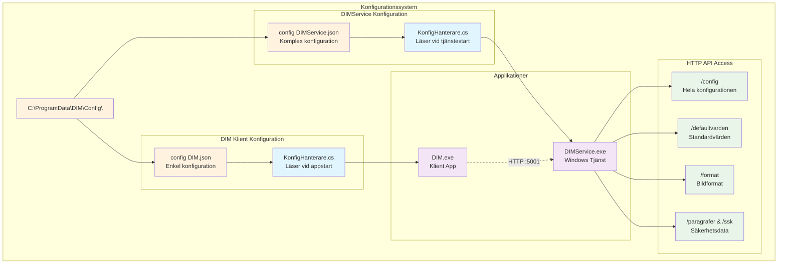
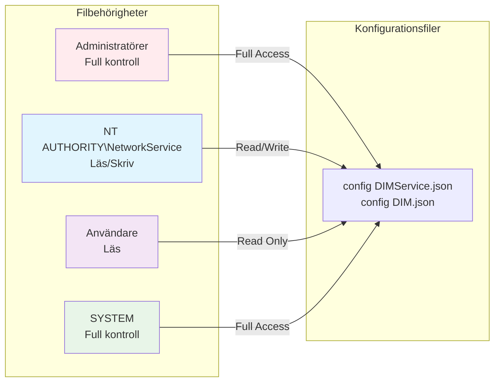
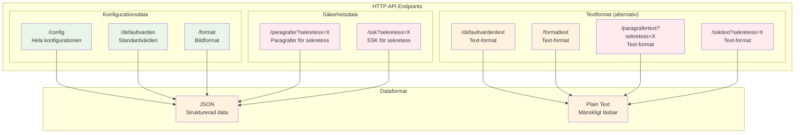
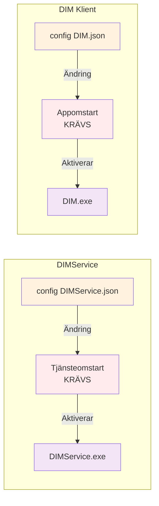

# DIM - Konfigurationsfiler Teknikerguide
## Digital Informationsmarkering - Konfigurationshantering


### Dokumentversion
- **Version:** 1.0
- **Datum:** 2025-07-02
- **Målgrupp:** Tekniker och systemadministratörer
- **Syfte:** Konfigurationshantering för DIM-systemet

---

## 1. Översikt

### 1.1 Varför finns konfigurationsfilerna?

**För dig som tekniker:** Konfigurationsfilerna är **hjärtat i DIM-systemets funktion**. De bestämmer inte bara hur systemet fungerar, utan även om det fungerar överhuvudtaget. Utan korrekt konfiguration startar varken DIMService eller DIM-klienten.

#### Varför inte hårdkoda inställningarna i programkoden?

Om alla inställningar var inbyggda i programkoden - varje gång du behövde ändra organisationsnamn, lägga till en ny säkerhetsklassificering eller byta port skulle det kräva omkompilering och ny programversion. Konfigurationsfilerna löser detta genom att separera **inställningar** från **funktionalitet**.

#### Kritiska funktioner som konfigurationsfilerna fyller:

**🔒 Säkerhet - Regelefterlevnad och klassificering**
- **Vad det innebär:** Säkerhetsklassificeringar (Hemlig, SK, etc.) och paragrafkopplingar definieras i konfigurationen
- **Praktiskt exempel:** När OSL-lagstiftningen ändras kan du uppdatera paragrafkopplingar utan systemomstart
- **Som tekniker:** Du ansvarar för att säkerhetsklassificeringarna följer aktuell lagstiftning
- **Utan konfiguration:** Säkerhetsklassificeringar skulle vara statiska och snabbt föråldrade

**📈 Skalbarhet - Ändringar utan kodmodifikationer**
- **Vad det innebär:** Systemet kan växa och anpassas utan att kräva nya programversioner
- **Praktiskt exempel:** Lägg till nya bildformat, ändra standardstorlekar, konfigurera för fjärrservrar
- **Som tekniker:** Du kan göra förändringar direkt i produktionsmiljön (med försiktighet)
- **Utan konfiguration:** Varje ändring skulle kräva utvecklarresurser och deployment

**📋 Standardisering - Konsekvent beteende**
- **Vad det innebär:** Alla användare får samma standardinställningar och beteenden
- **Praktiskt exempel:** Alla stämplar får samma storlek, färg och format inom organisationen
- **Som tekniker:** Du säkerställer att alla instanser av systemet fungerar identiskt
- **Utan konfiguration:** Olika användare kunde få olika beteenden beroende på installation

**⚖️ Compliance - Juridisk efterlevnad**
- **Vad det innebär:** Systemet måste följa svenska offentlighets- och sekretesslagen (OSL)
- **Praktiskt exempel:** Korrekta paragrafkopplingar, rätt formuleringar, godkända klassificeringar
- **Som tekniker:** Du ansvarar för att systemet uppfyller juridiska krav
- **Utan konfiguration:** Lagändringar skulle göra systemet obrukbart tills ny version utvecklas

#### Konsekvenser av felaktig konfiguration

**🚨 Vad händer när konfigurationen är fel:**
- **DIMService startar inte** → Ingen backend-funktionalitet
- **DIM-klient kan inte ansluta** → Användare ser felmeddelanden
- **Felaktiga säkerhetsklassificeringar** → Juridiska problem
- **Fel portkonfiguration** → Kommunikationsproblem mellan komponenter

**✅ Vad framgångsrik konfiguration ger:**
- **Smidig systemstart** utan manuella ingrepp
- **Korrekt säkerhetsklassificering** enligt gällande lag
- **Anpassad organisationsinformation** i alla stämplar
- **Flexibilitet för framtida ändringar** utan systemuppgraderingar

#### Din roll som tekniker

Som tekniker är du **konfigurationsansvarig** vilket innebär:
- **Förstå** vad varje konfigurationsparameter gör
- **Validera** ändringar innan de implementeras i produktion
- **Övervaka** systemets beteende efter konfigurationsändringar
- **Dokumentera** alla ändringar för spårbarhet
- **Ha beredskap** för snabb återställning vid problem

**Viktigt att komma ihåg:** Konfigurationsfilerna är inte bara "inställningsfiler" - de är **kritiska systemkomponenter** som direkt påverkar DIM-systemets funktion och juridiska efterlevnad.

### 1.2 Konfigurationsfiernas arkitektur



---

## 2. Konfigurationsfilernas placering

### 2.1 Standardsökvägar

| Fil | Fullständig sökväg | Beskrivning |
|-----|-------------------|-------------|
| **DIMService config** | `C:\ProgramData\DIM\Config\config DIMService.json` | Tjänstens huvudkonfiguration |
| **DIM klient config** | `C:\ProgramData\DIM\Config\config DIM.json` | Klientens anslutningsinställningar |

### 2.2 Varför ProgramData?
- **Systemomfattande:** Tillgänglig för alla användare
- **Säkerhet:** Skyddad mot vanliga användare
- **Persistent:** Överlever användarprofilsändringar
- **Standardiserad:** Microsoft-rekommenderad plats för applikationsdata

### 2.3 Filbehörigheter



---

## 3. DIMService konfigurationsfil

### 3.1 Övergripande struktur

**Fil:** `config DIMService.json`

```json
{
  "Lyssnarport": 5001,
  "Defaultvarden": [...],
  "Format": [...],
  "Sekretess": [...]
}
```

### 3.2 Lyssnarport

**Funktion:** Definierar vilken port HTTP-servern lyssnar på

```json
"Lyssnarport": 5001
```

**Tekniska detaljer:**
- **Datatyp:** `int`
- **Standardvärde:** `5001`
- **Användning:** `http://localhost:5001/`
- **Validering:** Måste vara ledig port (1024-65535)

**Påverkan vid ändring:**
- Kräver omstart av DIMService-tjänsten
- Alla klienter måste uppdatera sin `config DIM.json`
- Brandväggsinställningar kan behöva justeras

### 3.3 Defaultvärden

**Funktion:** Standardinställningar för dokumentmarkering

```json
"Defaultvarden": [
  {
    "Kod": "VerksamhetNamn",
    "Text": "Statens Fastighetsverk\r\n(SFV)",
    "Varde": 0
  },
  {
    "Kod": "Format",
    "Text": "svg",
    "Varde": 0
  },
  {
    "Kod": "Bredd",
    "Text": "",
    "Varde": 302
  },
  {
    "Kod": "Hojd", 
    "Text": "",
    "Varde": 182
  },
  {
    "Kod": "BreddHanvisning",
    "Text": "",
    "Varde": 302
  },
  {
    "Kod": "HojdHanvisning",
    "Text": "",
    "Varde": 66
  }
]
```

**Tillgängliga standardvärden:**

| Kod | Beskrivning | Datatyp | Exempel |
|-----|-------------|---------|---------|
| `VerksamhetNamn` | Organisationsnamn | Text | "Statens Fastighetsverk\r\n(SFV)" |
| `Format` | Standardbildformat | Text | "svg", "png", "emf" |
| `Bredd` | Stämpelbredd (pixlar) | Numerisk | 302 |
| `Hojd` | Stämpelhöjd (pixlar) | Numerisk | 182 |
| `BreddHanvisning` | Hänvisningsbredd | Numerisk | 302 |
| `HojdHanvisning` | Hänvisningshöjd | Numerisk | 66 |

### 3.4 Format

**Funktion:** Definierar tillgängliga bildformat för exportering

```json
"Format": [
  {
    "Kod": "emf",
    "Text": "emf",
    "Beskrivning": "Metafil"
  },
  {
    "Kod": "png",
    "Text": "png", 
    "Beskrivning": "Rasterfil"
  },
  {
    "Kod": "svg",
    "Text": "svg",
    "Beskrivning": "Vektorfil"
  }
]
```

**Formatdetaljer:**

| Format | Beskrivning | Användning | Tekniska egenskaper |
|--------|-------------|------------|-------------------|
| **EMF** | Enhanced Metafile | Windows-dokument | Vektor, skalbar, metadata-stöd |
| **PNG** | Portable Network Graphics | Webben, presentationer | Raster, transparent bakgrund |
| **SVG** | Scalable Vector Graphics | Modern webb, print | XML-baserad, fullt skalbar |

### 3.5 Sekretess (Huvudsektion)

**Funktion:** Definierar säkerhetsklassificeringar enligt svensk lagstiftning

```json
"Sekretess": [
  {
    "Kod": "Ö",
    "Text": "EJ SEKRETESS",
    "HarParagrafer": false,
    "HarSSK": false
  },
  {
    "Kod": "Hemlig",
    "Text": "HEMLIG", 
    "HarParagrafer": true,
    "HarSSK": true,
    "Paragrafer": [...],
    "SSK": [...]
  },
  {
    "Kod": "SK",
    "Text": "SEKRETESS-\r\nKLASSIFICERAD",
    "HarParagrafer": true,
    "HarSSK": false,
    "Paragrafer": [...]
  }
]
```

**Tillgängliga sekretessklassificeringar:**

| Kod | Klassificering | Har Paragrafer | Har SSK | Användning |
|-----|---------------|---------------|---------|------------|
| **Ö** | EJ SEKRETESS | Nej | Nej | Öppen information |
| **Hemlig** | HEMLIG | Ja | Ja | Säkerhetsskyddsklassad information |
| **SK** | SEKRETESS-KLASSIFICERAD | Ja | Nej | Sekretessbelagd utan SSK |

### 3.6 Paragrafer

**Funktion:** Juridiska grunder för sekretessklassificering enligt Offentlighets- och sekretesslagen

```json
"Paragrafer": [
  {
    "Kod": "P15K1",
    "Text": "15 kap. 1 §",
    "Beskrivning": "Utrikessekretess"
  },
  {
    "Kod": "P15K2", 
    "Text": "15 kap. 2 §",
    "Beskrivning": "Försvarssekretess"
  }
]
```

**Tillgängliga paragrafer:**

| Kod | Paragraf | Beskrivning | Tillämpningsområde |
|-----|----------|-------------|-------------------|
| `P15K1` | 15 kap. 1 § | Utrikessekretess | Utrikesrelationer, diplomati |
| `P15K2` | 15 kap. 2 § | Försvarssekretess | Militära frågor, försvar |
| `P18K8` | 18 kap. 8 § | Säkerhets-eller bevakningsåtgärd | Säkerhetsskydd |
| `P18K8a` | 18 kap. 8a § | Incidentrapporter | Säkerhetsincidenter |
| `P18K9` | 18 kap. 9 § | Chiffer kod m.m. | Kryptografi, kodning |
| `P39K1` | 39 kap. 1 § | Personalsocial verksamhet | Personalfrågor |
| `P39K2` | 39 kap. 2 § | Personaladministrativ verksamhet i övrigt | HR-administration |
| `P39K3` | 39 kap. 3 § | Adresser telefonnummer m.m. | Personuppgifter |

### 3.7 SSK (Säkerhetsskyddsklass)

**Funktion:** Definierar säkerhetsskyddsklassificering för hemlig information

```json
"SSK": [
  {
    "Kod": "BH",
    "Text": "Begränsat Hemlig"
  },
  {
    "Kod": "K", 
    "Text": "Konfidentiell"
  },
  {
    "Kod": "H",
    "Text": "Hemlig"
  }
]
```

**SSK-nivåer:**

| Kod | Klassificering | Beskrivning | Säkerhetskrav |
|-----|---------------|-------------|---------------|
| **BH** | Begränsat Hemlig | Lägsta hemlighetsnivå | Grundläggande säkerhetsskydd |
| **K** | Konfidentiell | Medelhög hemlighetsnivå | Förstärkt säkerhetsskydd |
| **H** | Hemlig | Högsta hemlighetsnivå | Maximalt säkerhetsskydd |

---

## 4. DIM klient konfigurationsfil

### 4.1 Struktur

**Fil:** `config DIM.json`

```json
{
  "Lyssnarport": 5001,
  "ServiceURL": "localhost"
}
```

### 4.2 Konfigurationsparametrar

| Parameter | Beskrivning | Standardvärde | Exempel |
|-----------|-------------|---------------|---------|
| `Lyssnarport` | Port för DIMService | `5001` | `5001`, `8080` |
| `ServiceURL` | Server för DIMService | `"localhost"` | `"localhost"`, `"dimserver.local"` |

### 4.3 Användningsscenarier

#### Lokal installation
```json
{
  "Lyssnarport": 5001,
  "ServiceURL": "localhost"
}
```

#### Fjärrserver
```json
{
  "Lyssnarport": 5001,
  "ServiceURL": "dimserver.company.local"
}
```

#### Alternativ port
```json
{
  "Lyssnarport": 8080,
  "ServiceURL": "localhost"
}
```

---

## 5. HTTP API för konfigurationsaccess

### 5.1 Tillgängliga endpoints



### 5.2 Endpoint-detaljer

#### `/config` - Komplett konfiguration
```bash
# Hämta hela konfigurationen
curl http://localhost:5001/config

# Svar: JSON med alla konfigurationsdata
{
  "Lyssnarport": 5001,
  "Defaultvarden": [...],
  "Format": [...], 
  "Sekretess": [...]
}
```

#### `/defaultvarden` - Standardvärden
```bash
# Hämta standardvärden
curl http://localhost:5001/defaultvarden

# Svar: Array med standardkonfiguration
[
  {
    "Kod": "VerksamhetNamn",
    "Text": "Statens Fastighetsverk\r\n(SFV)",
    "Varde": 0
  }
]
```

#### `/format` - Tillgängliga bildformat
```bash
# Hämta format
curl http://localhost:5001/format

# Svar: Array med bildformat
[
  {
    "Kod": "svg",
    "Text": "svg", 
    "Beskrivning": "Vektorfil"
  }
]
```

#### `/paragrafer?sekretess=X` - Paragrafer för sekretess
```bash
# Hämta paragrafer för "Hemlig"
curl "http://localhost:5001/paragrafer?sekretess=Hemlig"

# Svar: Array med paragrafer
[
  {
    "Kod": "P15K1",
    "Text": "15 kap. 1 §",
    "Beskrivning": "Utrikessekretess"
  }
]
```

#### `/ssk?sekretess=X` - SSK för sekretess
```bash
# Hämta SSK för "Hemlig"  
curl "http://localhost:5001/ssk?sekretess=Hemlig"

# Svar: Array med SSK-nivåer
[
  {
    "Kod": "BH",
    "Text": "Begränsat Hemlig"
  }
]
```

### 5.3 Textformat-endpoints

För mänskligt läsbara svar finns textversioner av alla endpoints:

```bash
# Textformat för standardvärden
curl http://localhost:5001/defaultvardentext

# Svar i textformat
VerksamhetNamn: Statens Fastighetsverk
(SFV)
Format: svg
Bredd: 302
```

---

## 6. Konfigurationshantering

### Vad innebär konfigurationshantering för dig som tekniker?

Konfigurationshantering är **hjärtat i DIM-systemets funktion** och en av de viktigaste aspekterna att förstå för en tekniker. När DIMService eller DIM-klienten startar måste de läsa sina konfigurationsfiler för att veta hur de ska fungera. Detta är inte bara en teknisk detalj - det påverkar direkt systemets tillgänglighet och funktion.

#### Varför är detta kritiskt att förstå?

**🚨 Konsekvenser av felaktig konfiguration:**
- **DIMService startar inte** → Ingen stämpelgenerering möjlig
- **DIM-klient kan inte ansluta** → Användare kan inte skapa stämplar
- **Felaktig portinställning** → Kommunikationsproblem mellan komponenter
- **Korrupt JSON-syntax** → Fullständigt systemstopp

**✅ Framgångsrik konfigurationshantering ger:**
- Smidig systemstart utan manuella ingrepp
- Tillförlitlig kommunikation mellan komponenter  
- Förutsägbart systembeteende
- Enkel felsökning när problem uppstår

#### Hur fungerar processen?

Varje gång DIMService eller DIM-klienten startar genomgår de en **kritisk valideringsprocess** där konfigurationsfilen kontrolleras i flera steg. Om något steg misslyckas **stoppas hela applikationen** för att förhindra oförutsägbart beteende.

Som tekniker behöver du förstå denna process för att:
- **Diagnostisera varför** en applikation inte startar
- **Validera konfigurationsändringar** innan du implementerar dem
- **Förstå felmeddelanden** i loggarna
- **Planera underhåll** och uppdateringar säkert

### 6.1 Inläsning och validering

Nedanstående diagram visar **exakt vad som händer** när DIMService startar och läser sin konfigurationsfil. Varje steg måste lyckas för att tjänsten ska starta framgångsrikt.


#### Förklaring av valideringsprocessen

**🔍 Vad händer i praktiken:**

1. **Filkontroll** - Systemet kontrollerar att konfigurationsfilen finns på rätt plats (`C:\ProgramData\DIM\Config\`)
2. **JSON-parsing** - Filen läses och parsas för att säkerställa korrekt JSON-syntax  
3. **Innehållsvalidering** - Obligatoriska fält och sektioner kontrolleras (t.ex. att `Sekretess`-sektionen finns)
4. **Konfigurationsladdning** - Data laddas in i systemets minne för användning

**⚠️ Viktigt att förstå:**
- **Ett enda fel stoppar hela processen** - systemet tolererar inga konfigurationsfel
- **Felet loggas alltid** till `C:\ProgramData\DIM\Logs\` för senare analys
- **Tjänsten/applikationen avslutas** med felkod - ingen partiell start möjlig
- **Automatisk återstart** (för DIMService) kommer att misslyckas om konfigurationen är felaktig

**🛠️ Som tekniker innebär detta:**
- **Testa alltid konfigurationsändringar** med JSON-validering innan omstart
- **Övervaka loggarna** efter konfigurationsändringar
- **Ha backup-plan klar** för snabb återställning vid problem
- **Förstå att systemet "failar säkert"** - hellre ingen tjänst än felkonfigurerad tjänst

### 6.2 Valideringsregler

**Teknisk referens:** Dessa kontroller utförs alltid när konfigurationen läses.

| Validering | Kontroll | Felmeddelande | Tekniker-åtgärd |
|------------|----------|---------------|----------------|
| **Filexistens** | `File.Exists(_filePath)` | `"Kunde inte hitta config-fil: {_filePath}"` | Kontrollera att filen finns och är tillgänglig |
| **JSON-syntax** | `JsonSerializer.Deserialize<KonfigData>(json)` | `"Felaktigt format i config DIMService.json."` | Validera JSON med editor eller PowerShell |
| **Obligatoriska fält** | `data.Sekretess != null` | `"Felaktigt format i config DIMService.json."` | Säkerställ att alla required sektioner finns |

**💡 Praktiska valideringstips:**
- **JSON-validering:** Använd `Get-Content file.json | ConvertFrom-Json` i PowerShell
- **Filrättigheter:** Kontrollera att NetworkService har läsrättigheter  
- **Encoding:** Spara alltid som UTF-8 utan BOM
- **Backup:** Validera att backup-filer också är korrekta

### 6.3 Felloggar

**För tekniker:** När konfigurationsfel uppstår skapas alltid detaljerade loggar som hjälper dig att diagnostisera problemet snabbt.

**Loggningsplacering:** `C:\ProgramData\DIM\Logs\`

**Exempel på felloggar:**
```json
{
  "Tidpunkt": "2024-12-19T10:30:00",
  "ExceptionTyp": "FileNotFoundException",
  "Meddelande": "Kunde inte hitta config-fil: C:\\ProgramData\\DIM\\Config\\config DIMService.json",
  "StackTrace": "..."
}
```

---

## 7. Ändringshantering

### 7.1 Konfigurationsläsning och cachning

**DIMService-beteende:**
- Konfigurationsfilen läses **endast vid tjänstestart**
- Alla konfigurationsdata **cachas i minnet** under körning
- **Ingen automatisk omladdning** - hot-reload stöds inte
- Ändringar kräver **explicit tjänsteomstart** för att träda i kraft
- Felaktig konfiguration **förhindrar tjänstestart**

**DIM-klientbeteende:**
- Konfigurationsfilen läses **vid applikationsstart**
- Minimal konfiguration - endast anslutningsinställningar
- **Ingen hot-reload** - kräver appomstart
- Felaktig konfiguration **förhindrar appstart**

### 7.2 När träder ändringar i kraft?



#### Omstartstider och påverkan

| Komponent | Genomsnittlig starttid | Påverkan under omstart | Automatisk återstart |
|-----------|----------------------|----------------------|-------------------|
| **DIMService** | 3-8 sekunder | API ej tillgängligt | Ja (Windows Service) |
| **DIM Klient** | 2-5 sekunder | Ej tillgänglig för användare | Nej (manuell start) |

### 7.3 Kritiska vs. icke-kritiska ändringar

#### Kritiska ändringar (kräver omstart)
**DIMService:**
- `Lyssnarport` - Ändrar HTTP-server binding
- `Sekretess` - Nya/ändrade säkerhetsklassificeringar
- `Format` - Nya/ändrade bildformat
- `Defaultvarden` - Standardinställningar för markeringar

**DIM Klient:**
- `Lyssnarport` - Ändrar serveranslutning
- `ServiceURL` - Ändrar serveradress

#### Riskbedömning för ändringar

| Ändringstyp | Risknivå | Rekommenderad tid | Pre-validering |
|-------------|----------|------------------|---------------|
| **Portändring** | 🔴 Hög | Underhållsfönster | Testa porttillgänglighet |
| **Ny säkerhetsklassificering** | 🟡 Medium | Arbetstid | Validera JSON-syntax |
| **Nya standardvärden** | 🟢 Låg | Arbetstid | API-test efter omstart |
| **Ny organisation** | 🟢 Låg | Arbetstid | Visuell verifiering |

### 7.4 Säkert ändringsförfarande

#### Pre-change checklist
Innan du genomför någon konfigurationsändring:

- [ ] **Dokumentera ändringen:** Vad, varför, när, vem
- [ ] **Testa i utvecklingsmiljö** (om tillgänglig)
- [ ] **Informera berörda användare** om planerat avbrott
- [ ] **Välj lämplig tid:** Underhållsfönster eller låg belastning
- [ ] **Säkerställ tillgång till backup** och rollback-procedur

#### Steg 1: Förberedelser och backup

```cmd
# Skapa backup-katalog med tidsstämpel
set BACKUP_TIME=%date:~0,4%%date:~5,2%%date:~8,2%_%time:~0,2%%time:~3,2%
mkdir "C:\ProgramData\DIM\Backup\%BACKUP_TIME%"

# Säkerhetskopiera DIMService-konfiguration
copy "C:\ProgramData\DIM\Config\config DIMService.json" "C:\ProgramData\DIM\Backup\%BACKUP_TIME%\config DIMService.json"

# Säkerhetskopiera DIM-klientkonfiguration  
copy "C:\ProgramData\DIM\Config\config DIM.json" "C:\ProgramData\DIM\Backup\%BACKUP_TIME%\config DIM.json"

# Säkerhetskopiera eventuella anpassade konfigurationer
xcopy "C:\ProgramData\DIM\Config\*" "C:\ProgramData\DIM\Backup\%BACKUP_TIME%\" /E /Y

echo Backup completerat: C:\ProgramData\DIM\Backup\%BACKUP_TIME%\
```

#### Steg 2: Pre-change validering

```cmd
# Validera nuvarande konfiguration med PowerShell
powershell -Command "
try { 
    $config = Get-Content 'C:\ProgramData\DIM\Config\config DIMService.json' | ConvertFrom-Json; 
    Write-Host 'Nuvarande konfiguration OK' -ForegroundColor Green 
} catch { 
    Write-Host 'VARNING: Nuvarande konfiguration felaktig!' -ForegroundColor Red; 
    Write-Host $_.Exception.Message 
}"

# Kontrollera tjänstestatus före ändring
sc query DIMService

# Testa API före ändring
curl http://localhost:5001/config
```

#### Steg 3: Kontrollerad tjänstestopp

```cmd
# Kontrollera vilka processer som använder DIM
tasklist | findstr /I "DIM"

# Logga vilka användare som är anslutna (om tillämpligt)
netstat -an | findstr :5001

# Stoppa DIMService med timeout
sc stop DIMService

# Vänta på att tjänsten stoppas (max 30 sekunder)
timeout /t 30 /nobreak

# Verifiera att tjänsten stoppats
sc query DIMService | findstr "STATE"

# Stäng eventuella DIM-klientapplikationer
taskkill /IM DIM.exe /F 2>nul
echo Klientapplikationer stängda
```

#### Steg 4: Implementera ändringar

**För portändringar (hög risk):**
```cmd
# Kontrollera att ny port är ledig
netstat -an | findstr :8080
# Ska inte returnera några resultat

# Testa att binda till ny port (Windows)
powershell -Command "
$listener = [System.Net.HttpListener]::new()
$listener.Prefixes.Add('http://localhost:8080/')
try { 
    $listener.Start()
    Write-Host 'Port 8080 är ledig' -ForegroundColor Green
    $listener.Stop()
} catch {
    Write-Host 'Port 8080 är UPPTAGEN!' -ForegroundColor Red
}"
```

**För konfigurationsredigering:**
```cmd
# Använd en robust texteditor med JSON-validering
# Rekommenderade editorer: VS Code, Notepad++, PowerShell ISE

# VIKTIGT: Säkerställ UTF-8 kodning utan BOM
# VS Code: Ctrl+Shift+P > "Change File Encoding" > "UTF-8"
# Notepad++: Encoding > "UTF-8 without BOM"
```

**Syntax-validering under redigering:**
```cmd
# Realtidsvalidering under redigering (PowerShell)
powershell -Command "
while ($true) {
    try {
        $config = Get-Content 'C:\ProgramData\DIM\Config\config DIMService.json' | ConvertFrom-Json
        Write-Host 'JSON OK' -ForegroundColor Green
    } catch {
        Write-Host 'JSON SYNTAX ERROR!' -ForegroundColor Red
        Write-Host $_.Exception.Message
    }
    Start-Sleep 2
}"
```

#### Steg 5: Post-change validering och start

```cmd
# Slutlig JSON-validering före tjänstestart
powershell -Command "
try { 
    $config = Get-Content 'C:\ProgramData\DIM\Config\config DIMService.json' | ConvertFrom-Json
    Write-Host 'Konfiguration validerad OK' -ForegroundColor Green
    Write-Host 'Lyssnarport:' $config.Lyssnarport
    Write-Host 'Antal sekretessklassificeringar:' $config.Sekretess.Count
} catch { 
    Write-Host 'KRITISKT FEL: JSON-syntax felaktig!' -ForegroundColor Red
    Write-Host $_.Exception.Message
    exit 1
}"

# Starta DIMService med timeout
net start DIMService

# Vänta på tjänstestart
timeout /t 10 /nobreak

# Kontrollera att tjänsten startat korrekt
sc query DIMService | findstr "STATE"

# Kontrollera att tjänsten lyssnar på korrekt port
netstat -an | findstr :5001
```

#### Steg 6: Funktionsverifiering

```cmd
# Grundläggande API-test
curl http://localhost:5001/config

# Detaljerat API-test
powershell -Command "
$baseUrl = 'http://localhost:5001'
$endpoints = @('/config', '/defaultvarden', '/format')

foreach ($endpoint in $endpoints) {
    try {
        $response = Invoke-RestMethod -Uri `"$baseUrl$endpoint`" -Method Get -TimeoutSec 10
        Write-Host `"✓ $endpoint : OK`" -ForegroundColor Green
    } catch {
        Write-Host `"✗ $endpoint : FAILED - $($_.Exception.Message)`" -ForegroundColor Red
    }
}
"

# Testa från DIM-klient (om installerad)
if (Test-Path "C:\Program Files\DIM\DIM\DIM.exe") {
    echo "Starta DIM-klient och verifiera anslutning manuellt"
    start "C:\Program Files\DIM\DIM\DIM.exe"
}
```

#### Rollback-procedur (vid problem)

```cmd
# Om något går fel - snabb rollback
echo "ROLLBACK INITIERAD"

# Stoppa tjänsten
net stop DIMService

# Återställ från backup
copy "C:\ProgramData\DIM\Backup\%BACKUP_TIME%\config DIMService.json" "C:\ProgramData\DIM\Config\config DIMService.json" /Y
copy "C:\ProgramData\DIM\Backup\%BACKUP_TIME%\config DIM.json" "C:\ProgramData\DIM\Config\config DIM.json" /Y

# Starta om tjänsten
net start DIMService

# Verifiera rollback
curl http://localhost:5001/config

echo "Rollback genomförd - kontrollera att systemet fungerar"
```

### 7.5 Vanliga ändringsscenarier

#### Scenario 1: Ändra lyssnarport (Hög risk)

**Bakgrund:** Standard port 5001 kolliderar med annan tjänst eller säkerhetspolicy kräver annan port.

**Steg för implementering:**

1. **Pre-validering:**
   ```cmd
   # Kontrollera vilka portar som är lediga
   netstat -an | findstr /C:":8080 "
   
   # Testa portbindning
   powershell -Command "
   $port = 8080
   try {
       $listener = [System.Net.Sockets.TcpListener]::new([System.Net.IPAddress]::Any, $port)
       $listener.Start()
       Write-Host 'Port $port är ledig' -ForegroundColor Green
       $listener.Stop()
   } catch {
       Write-Host 'Port $port är UPPTAGEN!' -ForegroundColor Red
   }"
   ```

2. **Uppdatera DIMService-config:**
   ```json
   {
     "Lyssnarport": 8080,
     "Defaultvarden": [ ... ],
     "Format": [ ... ],
     "Sekretess": [ ... ]
   }
   ```

3. **Uppdatera alla klient-configs:**
   ```json
   {
     "Lyssnarport": 8080,
     "ServiceURL": "localhost"
   }
   ```

4. **Brandväggsinställningar:**
   ```cmd
   # Ta bort gammal regel
   netsh advfirewall firewall delete rule name="DIMService-5001"
   
   # Lägg till ny regel
   netsh advfirewall firewall add rule name="DIMService-8080" dir=in action=allow protocol=TCP localport=8080
   
   # Verifiera regel
   netsh advfirewall firewall show rule name="DIMService-8080"
   ```

5. **Omstart och verifiering:**
   ```cmd
   net stop DIMService
   net start DIMService
   
   # Kontrollera att tjänsten lyssnar på ny port
   netstat -an | findstr :8080
   
   # Testa API på ny port
   curl http://localhost:8080/config
   ```

#### Scenario 2: Ändra standardvärden för organisation

**Bakgrund:** Byte av organisationsnamn eller standardinställningar.

```json
{
  "Defaultvarden": [
    {
      "Kod": "VerksamhetNamn",
      "Text": "NYTT ORGANISATIONSNAMN\r\n(KORT)",
      "Varde": 0
    },
    {
      "Kod": "Bredd",
      "Text": "",
      "Varde": 450
    },
    {
      "Kod": "Hoger", 
      "Text": "",
      "Varde": 25
    },
    {
      "Kod": "Ner",
      "Text": "",
      "Varde": 25
    }
  ]
}
```

**Verifiering:**
```cmd
# Kontrollera standardvärden via API
curl http://localhost:5001/defaultvarden

# Starta DIM-klient och kontrollera visuellt att nya standardvärden används
start "C:\Program Files\DIM\DIM\DIM.exe"
```

#### Scenario 3: Aktivera/inaktivera bildformat

**Bakgrund:** Organisationen behöver begränsa eller utöka tillgängliga exportformat.

```json
{
  "Format": [
    {
      "Kod": "emf",
      "Text": "Enhanced Metafile (EMF)",
      "Aktiv": true,
      "Beskrivning": "Rekommenderat format för Office-dokument"
    },
    {
      "Kod": "png", 
      "Text": "Portable Network Graphics (PNG)",
      "Aktiv": true,
      "Beskrivning": "Bitmapformat för webbanvändning"
    },
    {
      "Kod": "svg",
      "Text": "Scalable Vector Graphics (SVG)", 
      "Aktiv": false,
      "Beskrivning": "Vektorformat - INAKTIVERAT pga kompatibilitetsproblem"
    }
  ]
}
```

**Praktiska överväganden:**
- **EMF:** Rekommenderas för Word/Excel-integration
- **PNG:** Bra för webbapplikationer och e-post
- **SVG:** Endast om målsystemet stöder formatet fullt ut


---

## 8. Troubleshooting och diagnostik

### 8.1 Vanliga konfigurationsproblem

#### Problem: Tjänsten startar inte efter konfigurationsändring
**Symptom:** `net start DIMService` misslyckas

**Möjliga orsaker:**
1. **Ogiltig JSON-syntax**
   ```cmd
   # Kontrollera syntax
   powershell -Command "Get-Content 'config DIMService.json' | ConvertFrom-Json"
   ```

2. **Port redan används**
   ```cmd
   # Kontrollera vad som använder porten
   netstat -ano | findstr :5001
   ```

3. **Filbehörigheter**
   ```cmd
   # Kontrollera åtkomst
   icacls "C:\ProgramData\DIM\Config\config DIMService.json"
   ```

#### Problem: Klient kan inte ansluta till tjänsten
**Symptom:** DIM-klienten visar "Anslutning misslyckades"

**Lösning:**
1. **Kontrollera tjänststatus**
   ```cmd
   sc query DIMService
   ```

2. **Verifiera portinställningar**
   ```cmd
   # Kontrollera att tjänsten lyssnar
   netstat -an | findstr :5001
   ```

3. **Testa API-anslutning**
   ```cmd
   curl http://localhost:5001/config
   ```

### 8.2 Diagnostikverktyg

#### Konfigurationsvalidering via PowerShell
```powershell
# Validera DIMService-konfiguration
try {
    $config = Get-Content "C:\ProgramData\DIM\Config\config DIMService.json" | ConvertFrom-Json
    Write-Host "✓ Giltig JSON-syntax" -ForegroundColor Green
    
    if ($config.Lyssnarport) {
        Write-Host "✓ Lyssnarport: $($config.Lyssnarport)" -ForegroundColor Green
    }
    
    if ($config.Sekretess) {
        Write-Host "✓ Sekretessdata finns: $($config.Sekretess.Count) nivåer" -ForegroundColor Green
    }
} catch {
    Write-Host "✗ Felaktig JSON: $($_.Exception.Message)" -ForegroundColor Red
}
```

#### API-testskript
```powershell
# Testa alla endpoints
$baseUrl = "http://localhost:5001"
$endpoints = @("/config", "/defaultvarden", "/format")

foreach ($endpoint in $endpoints) {
    try {
        $response = Invoke-RestMethod -Uri "$baseUrl$endpoint" -Method Get
        Write-Host "✓ $endpoint: OK" -ForegroundColor Green
    } catch {
        Write-Host "✗ $endpoint: $($_.Exception.Message)" -ForegroundColor Red
    }
}
```

### 8.3 Logganalys

**Kontrollera DIMService-loggar:**
```cmd
# Visa senaste felloggar
curl http://localhost:5001/fellogg

# Eller lokalt i filer
dir "C:\ProgramData\DIM\Logs\*.json"
```

**Windows Event Log:**
```cmd
# Visa tjänsterelaterade händelser
eventvwr.msc
# Navigera till: Windows Logs > Application
# Filtrera på Source: DIMService
```

---

## 9. Prestanda och optimering

### 9.1 Konfigurationscache
- **DIMService:** Konfigurationen cachas i minnet vid tjänstestart
- **Inga automatiska omladdningar:** Kräver tjänsteomstart för ändringar
- **Minnesanvändning:** Minimal - JSON deserialiseras till objekt en gång

### 9.2 API-prestanda
- **Cachad data:** Alla endpoints serverar samma cachadekonfiguration
- **Ingen diskåtkomst:** Data läses från minnet vid API-anrop
- **Responstider:** Typiskt <10ms för konfigurationsendpoints

### 9.3 Optimeringsriktlinjer

#### Konfigurationsstorlek
- **Rekommenderat:** Max 1000 paragrafer per säkerhetsklassificering
- **Filstorlek:** Håll under 1MB för optimal prestanda
- **Minnesanvändning:** ~10x filstorlek i RAM när laddad

#### Nätverkstrafik
```json
// Minimera JSON-storlek genom att ta bort onödiga mellanslag
{"Lyssnarport":5001,"Format":[{"Kod":"svg","Text":"svg","Beskrivning":"Vektorfil"}]}

// Istället för:
{
  "Lyssnarport": 5001,
  "Format": [
    {
      "Kod": "svg",
      "Text": "svg", 
      "Beskrivning": "Vektorfil"
    }
  ]
}
```

---

## 10. Säkerhet och compliance

### 10.1 Säkerhetshänsyn

#### Filskydd
- **Kryptering:** Konfigurationsfiler lagras okrypterat (innehåller ej känslig data)
- **Åtkomstkontroll:** NTFS-behörigheter skyddar mot obehörig ändring
- **Backup:** Implementera regelbunden säkerhetskopiering

#### API-säkerhet
- **Lokal bindning:** HTTP-server binder endast till localhost som standard
- **Ingen autentisering:** API:et förutsätter trusted lokalt nätverk
- **HTTPS:** Ej implementerat för lokal kommunikation

### 10.2 Compliance-stöd

#### Juridisk efterlevnad
- **OSL-stöd:** Paragrafer mappade till Offentlighets- och sekretesslagen
- **SSK-klassificering:** Stöd för svenska säkerhetsskyddsklasser
- **Revisionsspår:** Alla ändringar bör loggas externt

#### Dokumentation och spårbarhet
```json
// Exempel på metadata som kan spåras
{
  "Konfiguration": {
    "Version": "1.0",
    "Senast_andrad": "2024-12-19T10:30:00Z",
    "Andrad_av": "admin@company.se",
    "Anledning": "Ny säkerhetsklassificering enligt direktiv 2024:1"
  }
}
```

---

## 11. Support och underhåll

### 11.1 Rutinunderhåll

#### Månadsvis kontroll
- **Validera konfigurationssyntax**
- **Kontrollera loggfilsstorlekar** 
- **Verifiera API-endpoints**
- **Testa backup-återställning**

#### Kvartalsvis granskning
- **Uppdatera säkerhetsklassificeringar**
- **Granska och städa loggar**
- **Optimera konfigurationsstorlek**
- **Dokumentera ändringar**

### 11.2 Backup-strategi

#### Automatisk backup före ändringar
```cmd
@echo off
set CONFIG_DIR=C:\ProgramData\DIM\Config
set BACKUP_DIR=C:\ProgramData\DIM\Backup\%date:~0,4%%date:~5,2%%date:~8,2%

mkdir "%BACKUP_DIR%"
copy "%CONFIG_DIR%\*.json" "%BACKUP_DIR%\"
echo Backup complete: %BACKUP_DIR%
```

#### Versionshantering
```cmd
# Git-baserad versionering (rekommenderat)
cd C:\ProgramData\DIM\Config
git init
git add *.json
git commit -m "Initial configuration"

# Vid ändringar
git add config DIMService.json
git commit -m "Uppdaterad lyssnarport till 8080"
```

### 11.3 Kontaktinformation
- **Utvecklare:** Dynalab AB - www.dynalab.se
- **Support:** joakim.sjodin@dynalab.se
- **Dokumentation:** Se projektets README och docs-mapp för teknisk dokumentation

---

## 12. Versionshistorik
| Version | Datum | Förändringar |
|---------|--------|--------------|
| 1.0 | 2025-07-02 | Initial version av konfigurationsdokumentation |

 
