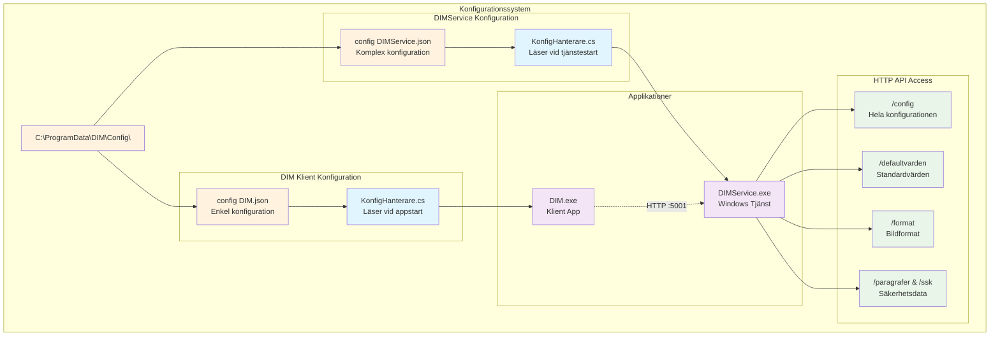
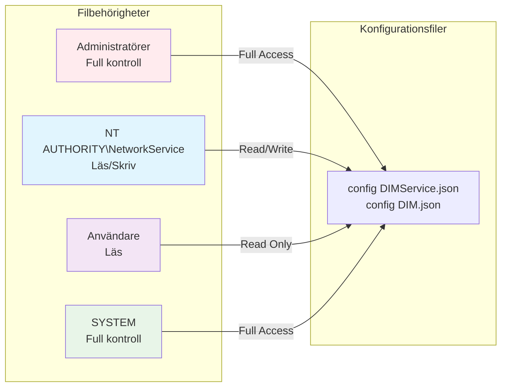
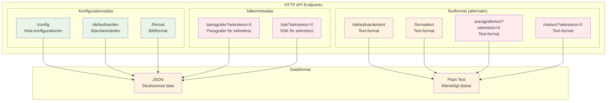
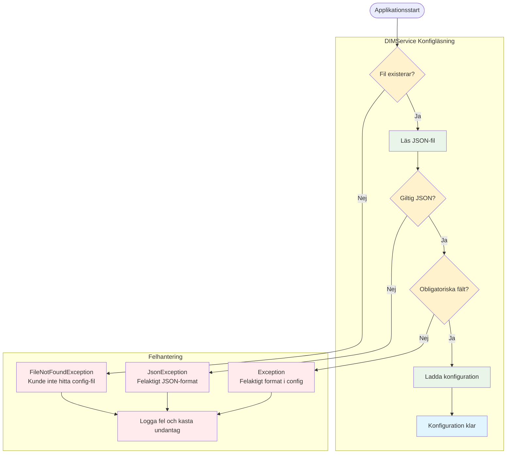
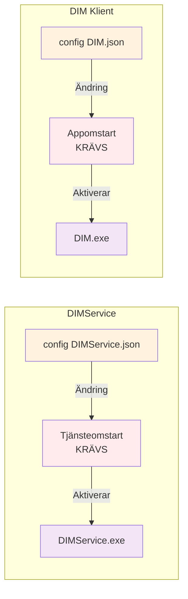

# DIM - Konfigurationsfiler Tekniker Guide
## Digital InformationsMarkering - Konfigurationshantering


### Dokumentversion
- **Version:** 1.0
- **Datum:** 2024-12-19
- **Målgrupp:** Tekniker och systemadministratörer
- **Syfte:** Konfigurationshantering för DIM-systemet

---

## 1. Översikt

### 1.1 Varför finns konfigurationsfilerna?
Konfigurationsfilerna är hjärtat i DIM-systemet och fyller flera kritiska funktioner:

- **Flexibilitet:** Möjliggör anpassning av systemet till olika organisationers behov
- **Säkerhet:** Definierar säkerhetsklassificeringar och regelefterlevnad
- **Skalbarhet:** Tillåter enkla ändringar utan kodmodifikationer
- **Standardisering:** Säkerställer konsekvent hantering av informationsmarkeringar
- **Compliance:** Stöder juridiska krav för dokumentklassificering

### 1.2 Konfigurationsfiernas arkitektur



---

## 2. Konfigurationsfilernas placering

### 2.1 Standardsökvägar

| Fil | Fullständig sökväg | Beskrivning |
|-----|-------------------|-------------|
| **DIMService config** | `C:\ProgramData\DIM\Config\config DIMService.json` | Tjänstens huvudkonfiguration |
| **DIM klient config** | `C:\ProgramData\DIM\Config\config DIM.json` | Klientens anslutningsinställningar |

### 2.2 Varför ProgramData?
- **Systemomfattande:** Tillgänglig för alla användare
- **Säkerhet:** Skyddad mot vanliga användare
- **Persistent:** Överlever användarprofilsändringar
- **Standardiserad:** Microsoft-rekommenderad plats för applikationsdata

### 2.3 Filbehörigheter



---

## 3. DIMService Konfigurationsfil

### 3.1 Övergripande struktur

**Fil:** `config DIMService.json`

```json
{
  "Lyssnarport": 5001,
  "Defaultvarden": [...],
  "Format": [...],
  "Sekretess": [...]
}
```

### 3.2 Lyssnarport

**Funktion:** Definierar vilken port HTTP-servern lyssnar på

```json
"Lyssnarport": 5001
```

**Tekniska detaljer:**
- **Datatyp:** `int`
- **Standardvärde:** `5001`
- **Användning:** `http://localhost:5001/`
- **Validering:** Måste vara ledig port (1024-65535)

**Påverkan vid ändring:**
- Kräver omstart av DIMService-tjänsten
- Alla klienter måste uppdatera sin `config DIM.json`
- Brandväggsinställningar kan behöva justeras

### 3.3 Defaultvärden

**Funktion:** Standardinställningar för dokumentmarkering

```json
"Defaultvarden": [
  {
    "Kod": "VerksamhetNamn",
    "Text": "Statens Fastighetsverk\r\n(SFV)",
    "Varde": 0
  },
  {
    "Kod": "Format",
    "Text": "svg",
    "Varde": 0
  },
  {
    "Kod": "Bredd",
    "Text": "",
    "Varde": 302
  },
  {
    "Kod": "Hojd", 
    "Text": "",
    "Varde": 182
  }
]
```

**Tillgängliga standardvärden:**

| Kod | Beskrivning | Datatyp | Exempel |
|-----|-------------|---------|---------|
| `VerksamhetNamn` | Organisationsnamn | Text | "Statens Fastighetsverk\r\n(SFV)" |
| `Format` | Standardbildformat | Text | "svg", "png", "emf" |
| `Bredd` | Stämpelbredd (pixlar) | Numerisk | 302 |
| `Hojd` | Stämpelhöjd (pixlar) | Numerisk | 182 |
| `BreddHanvisning` | Hänvisningsbredd | Numerisk | 302 |
| `HojdHanvisning` | Hänvisningshöjd | Numerisk | 66 |

### 3.4 Format

**Funktion:** Definierar tillgängliga bildformat för exportering

```json
"Format": [
  {
    "Kod": "emf",
    "Text": "emf",
    "Beskrivning": "Metafil"
  },
  {
    "Kod": "png",
    "Text": "png", 
    "Beskrivning": "Rasterfil"
  },
  {
    "Kod": "svg",
    "Text": "svg",
    "Beskrivning": "Vektorfil"
  }
]
```

**Formatdetaljer:**

| Format | Beskrivning | Användning | Tekniska egenskaper |
|--------|-------------|------------|-------------------|
| **EMF** | Enhanced Metafile | Windows-dokument | Vektor, skalbar, metadata-stöd |
| **PNG** | Portable Network Graphics | Webben, presentationer | Raster, transparent bakgrund |
| **SVG** | Scalable Vector Graphics | Modern webb, print | XML-baserad, fullt skalbar |

### 3.5 Sekretess (Huvudsektion)

**Funktion:** Definierar säkerhetsklassificeringar enligt svensk lagstiftning

```json
"Sekretess": [
  {
    "Kod": "Ö",
    "Text": "EJ SEKRETESS",
    "HarParagrafer": false,
    "HarSSK": false
  },
  {
    "Kod": "Hemlig",
    "Text": "HEMLIG", 
    "HarParagrafer": true,
    "HarSSK": true,
    "Paragrafer": [...],
    "SSK": [...]
  }
]
```

### 3.6 Paragrafer

**Funktion:** Juridiska grunder för sekretessklassificering enligt Offentlighets- och sekretesslagen

```json
"Paragrafer": [
  {
    "Kod": "P15K1",
    "Text": "15 kap. 1 §",
    "Beskrivning": "Utrikessekretess"
  },
  {
    "Kod": "P15K2", 
    "Text": "15 kap. 2 §",
    "Beskrivning": "Försvarssekretess"
  }
]
```

**Tillgängliga paragrafer:**

| Kod | Paragraf | Beskrivning | Tillämpningsområde |
|-----|----------|-------------|-------------------|
| `P15K1` | 15 kap. 1 § | Utrikessekretess | Utrikesrelationer, diplomati |
| `P15K2` | 15 kap. 2 § | Försvarssekretess | Militära frågor, försvar |
| `P18K8` | 18 kap. 8 § | Säkerhets-/bevakningsåtgärd | Säkerhetsskydd |
| `P18K8a` | 18 kap. 8a § | Incidentrapporter | Säkerhetsincidenter |
| `P18K9` | 18 kap. 9 § | Chiffer, kod m.m. | Kryptografi, kodning |
| `P39K1` | 39 kap. 1 § | Personalsocial verksamhet | Personalfrågor |
| `P39K2` | 39 kap. 2 § | Personaladministrativ verksamhet | HR-administration |
| `P39K3` | 39 kap. 3 § | Adresser, telefonnummer | Personuppgifter |

### 3.7 SSK (Säkerhetsskyddsklass)

**Funktion:** Definierar säkerhetsskyddsklassificering för hemlig information

```json
"SSK": [
  {
    "Kod": "BH",
    "Text": "Begränsat Hemlig"
  },
  {
    "Kod": "K", 
    "Text": "Konfidentiell"
  },
  {
    "Kod": "H",
    "Text": "Hemlig"
  }
]
```

**SSK-nivåer:**

| Kod | Klassificering | Beskrivning | Säkerhetskrav |
|-----|---------------|-------------|---------------|
| **BH** | Begränsat Hemlig | Lägsta hemlighetsnivå | Grundläggande säkerhetsskydd |
| **K** | Konfidentiell | Medelhög hemlighetsnivå | Förstärkt säkerhetsskydd |
| **H** | Hemlig | Högsta hemlighetsnivå | Maximalt säkerhetsskydd |

---

## 4. DIM Klient Konfigurationsfil

### 4.1 Struktur

**Fil:** `config DIM.json`

```json
{
  "Lyssnarport": 5001,
  "ServiceURL": "localhost"
}
```

### 4.2 Konfigurationsparametrar

| Parameter | Beskrivning | Standardvärde | Exempel |
|-----------|-------------|---------------|---------|
| `Lyssnarport` | Port för DIMService | `5001` | `5001`, `8080` |
| `ServiceURL` | Server för DIMService | `"localhost"` | `"localhost"`, `"dimserver.local"` |

### 4.3 Användningsscenarier

#### Lokal installation
```json
{
  "Lyssnarport": 5001,
  "ServiceURL": "localhost"
}
```

#### Fjärrserver
```json
{
  "Lyssnarport": 5001,
  "ServiceURL": "dimserver.company.local"
}
```

#### Alternativ port
```json
{
  "Lyssnarport": 8080,
  "ServiceURL": "localhost"
}
```

---

## 5. HTTP API för konfigurationsaccess

### 5.1 Tillgängliga endpoints



### 5.2 Endpoint-detaljer

#### `/config` - Komplett konfiguration
```bash
# Hämta hela konfigurationen
curl http://localhost:5001/config

# Svar: JSON med alla konfigurationsdata
{
  "Lyssnarport": 5001,
  "Defaultvarden": [...],
  "Format": [...], 
  "Sekretess": [...]
}
```

#### `/defaultvarden` - Standardvärden
```bash
# Hämta standardvärden
curl http://localhost:5001/defaultvarden

# Svar: Array med standardkonfiguration
[
  {
    "Kod": "VerksamhetNamn",
    "Text": "Statens Fastighetsverk\r\n(SFV)",
    "Varde": 0
  }
]
```

#### `/format` - Tillgängliga bildformat
```bash
# Hämta format
curl http://localhost:5001/format

# Svar: Array med bildformat
[
  {
    "Kod": "svg",
    "Text": "svg", 
    "Beskrivning": "Vektorfil"
  }
]
```

#### `/paragrafer?sekretess=X` - Paragrafer för sekretess
```bash
# Hämta paragrafer för "Hemlig"
curl "http://localhost:5001/paragrafer?sekretess=Hemlig"

# Svar: Array med paragrafer
[
  {
    "Kod": "P15K1",
    "Text": "15 kap. 1 §",
    "Beskrivning": "Utrikessekretess"
  }
]
```

#### `/ssk?sekretess=X` - SSK för sekretess
```bash
# Hämta SSK för "Hemlig"  
curl "http://localhost:5001/ssk?sekretess=Hemlig"

# Svar: Array med SSK-nivåer
[
  {
    "Kod": "BH",
    "Text": "Begränsat Hemlig"
  }
]
```

### 5.3 Textformat-endpoints

För mänskligt läsbara svar finns textversioner av alla endpoints:

```bash
# Textformat för standardvärden
curl http://localhost:5001/defaultvardentext

# Svar i textformat
VerksamhetNamn: Statens Fastighetsverk
(SFV)
Format: svg
Bredd: 302
```

---

## 6. Konfigurationshantering

### 6.1 Inläsning och validering



### 6.2 Valideringsregler

| Validering | Kontroll | Felmeddelande |
|------------|----------|---------------|
| **Filexistens** | `File.Exists(_filePath)` | `"Kunde inte hitta config-fil: {_filePath}"` |
| **JSON-syntax** | `JsonSerializer.Deserialize<KonfigData>(json)` | `"Felaktigt format i config DIMService.json."` |
| **Obligatoriska fält** | `data.Sekretess != null` | `"Felaktigt format i config DIMService.json."` |

### 6.3 Felloggar

**Loggningsplacering:** `C:\ProgramData\DIM\Logs\`

**Exempel på felloggar:**
```json
{
  "Tidpunkt": "2024-12-19T10:30:00",
  "ExceptionTyp": "FileNotFoundException",
  "Meddelande": "Kunde inte hitta config-fil: C:\\ProgramData\\DIM\\Config\\config DIMService.json",
  "StackTrace": "..."
}
```

---

## 7. Ändringshantering

### 7.1 När träder ändringar i kraft?



### 7.2 Säkert ändringsförfarande

#### Steg 1: Backup av befintlig konfiguration
```cmd
# Säkerhetskopiera DIMService-konfiguration
copy "C:\ProgramData\DIM\Config\config DIMService.json" "C:\ProgramData\DIM\Config\config DIMService.json.backup"

# Säkerhetskopiera DIM-klientkonfiguration  
copy "C:\ProgramData\DIM\Config\config DIM.json" "C:\ProgramData\DIM\Config\config DIM.json.backup"
```

#### Steg 2: Validera JSON-syntax
```cmd
# Validera med PowerShell
powershell -Command "Get-Content 'C:\ProgramData\DIM\Config\config DIMService.json' | ConvertFrom-Json"

# Om ingen felutskrift = giltigt JSON
```

#### Steg 3: Stoppa tjänster
```cmd
# Stoppa DIMService
net stop DIMService

# Stäng DIM-klientapplikationer
taskkill /IM DIM.exe /F
```

#### Steg 4: Implementera ändringar
- Redigera konfigurationsfiler med valfri texteditor
- Säkerställ UTF-8-kodning utan BOM
- Kontrollera JSON-syntax

#### Steg 5: Starta tjänster och verifiera
```cmd
# Starta DIMService
net start DIMService

# Kontrollera att tjänsten startat korrekt
sc query DIMService

# Testa konfiguration via API
curl http://localhost:5001/config
```

### 7.3 Vanliga ändringsscenarier

#### Ändra lyssnarport
1. **Uppdatera DIMService-config:**
   ```json
   {
     "Lyssnarport": 8080,
     ...
   }
   ```

2. **Uppdatera alla klient-configs:**
   ```json
   {
     "Lyssnarport": 8080,
     "ServiceURL": "localhost"
   }
   ```

3. **Uppdatera brandväggsinställningar:**
   ```cmd
   netsh advfirewall firewall add rule name="DIMService-8080" dir=in action=allow protocol=TCP localport=8080
   ```

#### Lägga till ny säkerhetsklassificering
```json
{
  "Sekretess": [
    {
      "Kod": "Kvalificerad",
      "Text": "KVALIFICERAD SEKRETESS", 
      "HarParagrafer": true,
      "HarSSK": false,
      "Paragrafer": [
        {
          "Kod": "P26K1",
          "Text": "26 kap. 1 §",
          "Beskrivning": "Ekonomisk information"
        }
      ]
    }
  ]
}
```

#### Ändra standardvärden
```json
{
  "Defaultvarden": [
    {
      "Kod": "VerksamhetNamn",
      "Text": "Min Organisation\r\n(MO)",
      "Varde": 0
    },
    {
      "Kod": "Bredd", 
      "Text": "",
      "Varde": 400
    }
  ]
}
```

---

## 8. Troubleshooting och diagnostik

### 8.1 Vanliga konfigurationsproblem

#### Problem: Tjänsten startar inte efter konfigurationsändring
**Symptom:** `net start DIMService` misslyckas

**Möjliga orsaker:**
1. **Ogiltig JSON-syntax**
   ```cmd
   # Kontrollera syntax
   powershell -Command "Get-Content 'config DIMService.json' | ConvertFrom-Json"
   ```

2. **Port redan används**
   ```cmd
   # Kontrollera vad som använder porten
   netstat -ano | findstr :5001
   ```

3. **Filbehörigheter**
   ```cmd
   # Kontrollera åtkomst
   icacls "C:\ProgramData\DIM\Config\config DIMService.json"
   ```

#### Problem: Klient kan inte ansluta till tjänsten
**Symptom:** DIM-klienten visar "Anslutning misslyckades"

**Lösning:**
1. **Kontrollera tjänststatus**
   ```cmd
   sc query DIMService
   ```

2. **Verifiera portinställningar**
   ```cmd
   # Kontrollera att tjänsten lyssnar
   netstat -an | findstr :5001
   ```

3. **Testa API-anslutning**
   ```cmd
   curl http://localhost:5001/config
   ```

### 8.2 Diagnostikverktyg

#### Konfigurationsvalidering via PowerShell
```powershell
# Validera DIMService-konfiguration
try {
    $config = Get-Content "C:\ProgramData\DIM\Config\config DIMService.json" | ConvertFrom-Json
    Write-Host "✓ Giltig JSON-syntax" -ForegroundColor Green
    
    if ($config.Lyssnarport) {
        Write-Host "✓ Lyssnarport: $($config.Lyssnarport)" -ForegroundColor Green
    }
    
    if ($config.Sekretess) {
        Write-Host "✓ Sekretessdata finns: $($config.Sekretess.Count) nivåer" -ForegroundColor Green
    }
} catch {
    Write-Host "✗ Felaktig JSON: $($_.Exception.Message)" -ForegroundColor Red
}
```

#### API-testskript
```powershell
# Testa alla endpoints
$baseUrl = "http://localhost:5001"
$endpoints = @("/config", "/defaultvarden", "/format")

foreach ($endpoint in $endpoints) {
    try {
        $response = Invoke-RestMethod -Uri "$baseUrl$endpoint" -Method Get
        Write-Host "✓ $endpoint: OK" -ForegroundColor Green
    } catch {
        Write-Host "✗ $endpoint: $($_.Exception.Message)" -ForegroundColor Red
    }
}
```

### 8.3 Logganalys

**Kontrollera DIMService-loggar:**
```cmd
# Visa senaste felloggar
curl http://localhost:5001/fellogg

# Eller lokalt i filer
dir "C:\ProgramData\DIM\Logs\*.json"
```

**Windows Event Log:**
```cmd
# Visa tjänsterelaterade händelser
eventvwr.msc
# Navigera till: Windows Logs > Application
# Filtrera på Source: DIMService
```

---

## 9. Prestanda och optimering

### 9.1 Konfigurationscache
- **DIMService:** Konfigurationen cachas i minnet vid tjänstestart
- **Inga automatiska omladdningar:** Kräver tjänsteomstart för ändringar
- **Minnesanvändning:** Minimal - JSON deserialiseras till objekt en gång

### 9.2 API-prestanda
- **Cachad data:** Alla endpoints serverar samma cachadekonfiguration
- **Ingen diskåtkomst:** Data läses från minnet vid API-anrop
- **Responstider:** Typiskt <10ms för konfigurationsendpoints

### 9.3 Optimeringsriktlinjer

#### Konfigurationsstorlek
- **Rekommenderat:** Max 1000 paragrafer per säkerhetsklassificering
- **Filstorlek:** Håll under 1MB för optimal prestanda
- **Minnesanvändning:** ~10x filstorlek i RAM när laddad

#### Nätverkstrafik
```json
// Minimera JSON-storlek genom att ta bort onödiga mellanslag
{"Lyssnarport":5001,"Format":[{"Kod":"svg","Text":"svg","Beskrivning":"Vektorfil"}]}

// Istället för:
{
  "Lyssnarport": 5001,
  "Format": [
    {
      "Kod": "svg",
      "Text": "svg", 
      "Beskrivning": "Vektorfil"
    }
  ]
}
```

---

## 10. Säkerhet och compliance

### 10.1 Säkerhetshänsyn

#### Filskydd
- **Kryptering:** Konfigurationsfiler lagras okrypterat (innehåller ej känslig data)
- **Åtkomstkontroll:** NTFS-behörigheter skyddar mot obehörig ändring
- **Backup:** Implementera regelbunden säkerhetskopiering

#### API-säkerhet
- **Lokal bindning:** HTTP-server binder endast till localhost som standard
- **Ingen autentisering:** API:et förutsätter trusted lokalt nätverk
- **HTTPS:** Ej implementerat för lokal kommunikation

### 10.2 Compliance-stöd

#### Juridisk efterlevnad
- **OSL-stöd:** Paragrafer mappade till Offentlighets- och sekretesslagen
- **SSK-klassificering:** Stöd för svenska säkerhetsskyddsklasser
- **Revisionsspår:** Alla ändringar bör loggas externt

#### Dokumentation och spårbarhet
```json
// Exempel på metadata som kan spåras
{
  "Konfiguration": {
    "Version": "1.0",
    "Senast_andrad": "2024-12-19T10:30:00Z",
    "Andrad_av": "admin@company.se",
    "Anledning": "Ny säkerhetsklassificering enligt direktiv 2024:1"
  }
}
```

---

## 11. Support och underhåll

### 11.1 Rutinunderhåll

#### Månadsvis kontroll
- **Validera konfigurationssyntax**
- **Kontrollera loggfilsstorlekar** 
- **Verifiera API-endpoints**
- **Testa backup-återställning**

#### Kvartalsvis granskning
- **Uppdatera säkerhetsklassificeringar**
- **Granska och städa loggar**
- **Optimera konfigurationsstorlek**
- **Dokumentera ändringar**

### 11.2 Backup-strategi

#### Automatisk backup före ändringar
```cmd
@echo off
set CONFIG_DIR=C:\ProgramData\DIM\Config
set BACKUP_DIR=C:\ProgramData\DIM\Backup\%date:~0,4%%date:~5,2%%date:~8,2%

mkdir "%BACKUP_DIR%"
copy "%CONFIG_DIR%\*.json" "%BACKUP_DIR%\"
echo Backup complete: %BACKUP_DIR%
```

#### Versionshantering
```cmd
# Git-baserad versionering (rekommenderat)
cd C:\ProgramData\DIM\Config
git init
git add *.json
git commit -m "Initial configuration"

# Vid ändringar
git add config DIMService.json
git commit -m "Uppdaterad lyssnarport till 8080"
```

### 11.3 Kontaktinformation
- **Utvecklare:** Dynalab AB - www.dynalab.se
- **Support:** joakim.sjodin@dynalab.se
- **Dokumentation:** Se projektets README och docs-mapp för teknisk dokumentation

---

## 12. Versionshistorik
| Version | Datum | Förändringar |
|---------|--------|--------------|
| 1.0 | 2024-12-19 | Initial version av konfigurationsdokumentation |

---

*Detta dokument täcker fullständig konfigurationshantering för DIM-systemet riktat till tekniker och systemadministratörer. För utvecklardokumentation och kodspecifikationer, se projektets tekniska dokumentation.* 