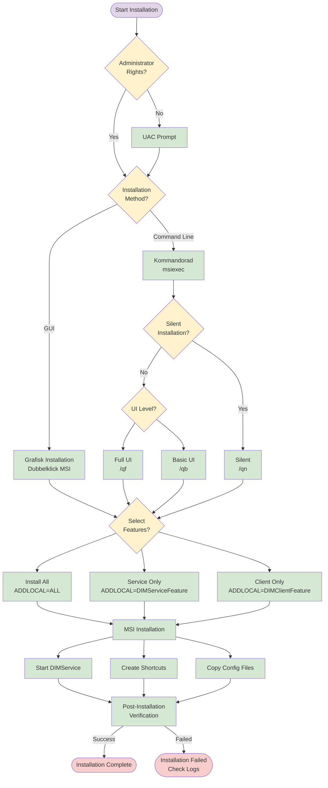
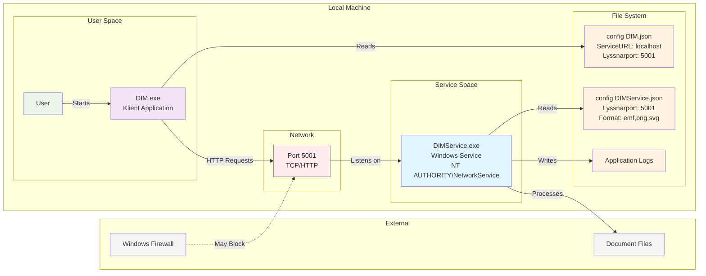

# DIM - Leveransdokumentation för MSI-Installation
## Digital InformationsMarkering - Tekniker Guide


### Dokumentversion
- **Version:** 1.0
- **Datum:** 2024-12-19
- **Målgrupp:** Tekniker och systemadministratörer
- **Syfte:** Installation, konfiguration och hantering av DIM MSI-paket

---

## 1. Översikt

### 1.1 Vad är DIM?
DIM (Digital InformationsMarkering) är ett system för att skapa och applicera säkerhetsklassificeringar och markeringar på digitala dokument. Systemet består av två huvudkomponenter som levereras i ett sammanhållet MSI-paket.

### 1.2 Leveransformat
DIM levereras som en Windows Installer-fil (`.msi`) med namnet `DIM_X_X_X_X.msi` där X_X_X_X representerar versionsnumret (t.ex. `DIM_1_0_0_123.msi`).

### 1.3 Systemöversikt


---

## 2. Systemkomponenter

### 2.1 Vad installeras?

MSI-paketet innehåller två huvudkomponenter som kan installeras separat eller tillsammans:

#### 2.1.1 DIMService (Windows-tjänst)
- **Fil:** `DIMService.exe`
- **Typ:** Windows-tjänst som körs automatiskt
- **Konto:** NT AUTHORITY\\NetworkService
- **Funktion:** Backend-tjänst som hanterar markering av dokument
- **Port:** Lyssnar på port 5001 (konfigurerbar)

#### 2.1.2 DIM (Klientapplikation)
- **Fil:** `DIM.exe`
- **Typ:** Windows-applikation med grafiskt användargränssnitt
- **Funktion:** Frontend för att konfigurera och använda markeringstjänsten
- **Genvägar:** Skapas på skrivbordet och i startmenyn

### 2.2 Inkluderade beroenden
- **.NET 8.0 Runtime:** Self-contained, inga externa .NET-installationer krävs
- **DLL-filer:** Alla nödvändiga bibliotek inkluderas
- **Konfigurationsfiler:** JSON-baserade konfigurationsfiler för båda komponenter

---

## 3. Systemkrav

### 3.1 Hårdvarukrav (minimum)
- **Processor:** x64-kompatibel processor
- **RAM:** 512 MB tillgängligt minne
- **Diskutrymme:** 200 MB ledigt utrymme på systemdisken
- **Nätverk:** Lokal nätverksanslutning (för kommunikation mellan komponenter)

### 3.2 Mjukvarukrav
- **Operativsystem:** Microsoft Windows 10 eller Windows 11 (x64)
- **Behörigheter:** Administratörsbehörighet krävs för installation
- **Brandvägg:** Port 5001 TCP måste vara tillgänglig lokalt

### 3.3 Nätverkskrav
- **Intern kommunikation:** HTTP-kommunikation på port 5001 mellan DIM-klient och DIMService
- **Internetanslutning:** Ej erforderlig för grundfunktionalitet

---

## 4. Installationsplatser och katalogstruktur

### 4.1 Programfiler
```
C:\Program Files\DIM\
├── DIM\                    # Klientapplikation
│   ├── DIM.exe
│   ├── *.dll              # .NET-bibliotek
│   ├── *.json             # Applikationsinställningar
│   └── *.pdb              # Debug-information
└── DIMService\            # Windows-tjänst
    ├── DIMService.exe
    ├── *.dll              # .NET-bibliotek
    ├── *.json             # Tjänstinställningar
    └── *.pdb              # Debug-information
```

### 4.2 Konfigurationsfiler
```
C:\ProgramData\DIM\
└── Config\
    ├── config DIM.json         # Klientkonfiguration
    └── config DIMService.json  # Tjänstkonfiguration
```

### 4.3 Arbetskataloger
```
C:\ProgramData\DIM\
├── Logs\                  # Felloggar och händelseloggar
└── Temp\                  # Temporära filer för dokumentvisning
```

### 4.4 Användargenvägar
- **Skrivbord:** `DIM.lnk` (om DIMClientFeature installeras)
- **Startmeny:** `%ProgramData%\Microsoft\Windows\Start Menu\Programs\DIM\DIM.lnk`

---

## 5. Installationsförfaranden

### 5.1 Installationsflöde



### 5.2 Behörigheter för installation
- **Krävs:** Administratörsbehörighet (UAC-prompt visas)
- **Orsak:** Installation av Windows-tjänst och systemfilkatalogerna
- **Rekommendation:** Kör installation från ett administratörskonto

### 5.3 Enkel installation (rekommenderat för de flesta)

#### Grafisk installation
1. **Högerklicka** på MSI-filen och välj **"Kör som administratör"**
2. **Eller dubbelklicka** på MSI-filen (UAC-prompt visas automatiskt)
3. Följ installationsguiden för att välja komponenter

#### Kommandoradsinstallation med basic UI
```cmd
msiexec /i DIM_1_0_0_123.msi /qb
```

### 5.4 Tysta installationer (för automatisering)

#### Helt tyst installation av alla komponenter
```cmd
msiexec /i DIM_1_0_0_123.msi /qn /L*V install.log
```

#### Tyst installation med loggning och specifika komponenter
```cmd
# Endast Windows-tjänsten
msiexec /i DIM_1_0_0_123.msi /qn ADDLOCAL=DIMServiceFeature /L*V dimservice_install.log

# Endast klientapplikationen
msiexec /i DIM_1_0_0_123.msi /qn ADDLOCAL=DIMClientFeature /L*V dimclient_install.log

# Alla komponenter
msiexec /i DIM_1_0_0_123.msi /qn ADDLOCAL=ALL /L*V dim_full_install.log
```

---

## 6. Installationsalternativ och Features

### 6.1 Tillgängliga Features

| Feature | Beskrivning | Komponenter |
|---------|-------------|-------------|
| `DIMServiceFeature` | Windows-tjänst | DIMService.exe + konfiguration |
| `DIMClientFeature` | Klientapplikation | DIM.exe + genvägar |
| `ALL` | Fullständig installation | Alla komponenter |

### 6.2 UI-nivåer för installation

| Parameter | Beskrivning | Användning |
|-----------|-------------|------------|
| `/qn` | Helt tyst installation | Automatisering, inga dialoger |
| `/qb` | Basic UI med progressbar | Halvautomatisk installation |
| `/qb+` | Basic UI + slutdialog | Som `/qb` men med bekräftelse |
| `/qf` | Full UI | Samma som dubbelklick på MSI |

### 6.3 Loggningsalternativ

```cmd
# Fullständig verbose-loggning
/L*V logfil.txt

# Exempel med olika loggningsnivåer
msiexec /i DIM_1_0_0_123.msi /qb /L*V "C:\Temp\DIM_Installation.log"
```

**Rekommendation:** Använd alltid loggning vid automatiserade installationer för felsökning.

---

## 7. Post-installation

### 7.1 Tjänstverifiering
Efter installation, kontrollera att DIMService-tjänsten körs:

```cmd
# Kontrollera tjänststatus
sc query DIMService

# Starta tjänsten manuellt om behov
net start DIMService

# Kontrollera att tjänsten lyssnar på rätt port
netstat -an | findstr :5001
```

### 7.2 Funktionstest
1. **Starta DIM-klienten** från skrivbordsgenvägen eller startmenyn
2. **Kontrollera anslutning** till DIMService (ska visas som "Ansluten" i klientgränssnittet)
3. **Testa grundfunktionalitet** genom att skapa en testmarkering

### 7.3 Brandväggskonfiguration
Om Windows Brandvägg blockerar kommunikation:

```cmd
# Tillåt DIMService genom brandväggen
netsh advfirewall firewall add rule name="DIMService" dir=in action=allow protocol=TCP localport=5001

# Eller via GUI: Windows Säkerhet > Brandvägg och nätverksskydd > Tillåt en app genom brandväggen
```

---

## 8. Konfiguration

### 8.1 Nätverkskommunikation



### 8.2 DIMService-konfiguration
**Fil:** `C:\ProgramData\DIM\Config\config DIMService.json`

**Viktiga inställningar:**
- `Lyssnarport`: Port som tjänsten lyssnar på (standard: 5001)
- `Sekretess`: Definierade säkerhetsklassificeringar och paragrafer
- `Format`: Tillgängliga utdataformat (emf, png, svg)

### 8.3 DIM-klientkonfiguration
**Fil:** `C:\ProgramData\DIM\Config\config DIM.json`

**Viktiga inställningar:**
- `Lyssnarport`: Port för kommunikation med DIMService (måste matcha tjänsten)
- `ServiceURL`: Serveradress för DIMService (standard: "localhost")

### 8.4 Redigering av konfigurationsfiler
⚠️ **VIKTIGT:** Starta om DIMService-tjänsten efter konfigurationsändringar:

```cmd
net stop DIMService
net start DIMService
```

---

## 9. Uppgraderingar

### 9.1 Hur uppgraderingar hanteras
- **UpgradeCode:** MSI-paketet använder en statisk UpgradeCode som säkerställer korrekt uppgraderingshantering
- **ProductCode:** Genereras automatiskt för varje version för att möjliggöra side-by-side-upptäckt
- **MajorUpgrade:** Konfigurerad för automatisk avinstallation av tidigare versioner

### 9.2 Uppgraderingsförfarande

#### Automatisk uppgradering
```cmd
# Installation av ny version avinstallerar automatiskt föregående version
msiexec /i DIM_1_0_1_150.msi /qb /L*V upgrade.log
```

#### Manuell uppgradering
1. **Stoppa DIMService-tjänsten** före uppgradering (rekommenderat)
   ```cmd
   net stop DIMService
   ```
2. **Installera ny MSI-version** enligt instruktioner ovan
3. **Verifiera installation** enligt post-installationsrutiner

### 9.3 Viktiga överväganden vid uppgradering
- **Konfigurationsfiler bevaras:** Befintliga inställningar skrivs inte över
- **Tjänstenamn bibehålls:** DIMService-tjänsten behåller sina inställningar
- **Användardata:** Loggar och temporära filer påverkas inte
- **Downgrades:** Blockeras för säkerhet (AllowDowngrades = false)

---

## 10. Avinstallation

### 10.1 Behörigheter för avinstallation
- **Krävs:** Administratörsbehörighet
- **Automatisk tjänststopp:** DIMService stoppas och avregistreras automatiskt

### 10.2 Avinstallationsmetoder

#### Via Kontrollpanelen
1. **Öppna:** Inställningar > Appar > Installerade appar
2. **Sök efter:** "DIM"
3. **Klicka:** Tre punkter > Avinstallera

#### Via kommandoraden
```cmd
# Identifiera ProductCode (från logg eller registret)
msiexec /x {PRODUCT-GUID} /qb /L*V uninstall.log

# Alternativt, med MSI-filen
msiexec /x DIM_1_0_0_123.msi /qb /L*V uninstall.log
```

#### Tyst avinstallation
```cmd
msiexec /x DIM_1_0_0_123.msi /qn /L*V silent_uninstall.log
```

### 10.3 Manuell rensning (om behov)
Om avinstallationen misslyckades eller var ofullständig:

#### Kontrollera att tjänsten är borttagen
```cmd
sc query DIMService
# Ska returnera "service does not exist"
```

#### Kontrollera att filer är borttagna
- `C:\Program Files\DIM\` (ska inte existera)
- `C:\ProgramData\DIM\Config\` (konfigurationsfiler kan finnas kvar)

#### Rensa registret (endast vid problem)
⚠️ **VARNING:** Ändra endast registret om du vet vad du gör

```
HKEY_LOCAL_MACHINE\SOFTWARE\Microsoft\Windows\CurrentVersion\Uninstall\
# Leta efter DIM-relaterade nycklar
```

---

## 11. Felsökning

### 11.1 Vanliga installationsproblem

#### Problem: "Installation misslyckades med felkod 1603"
**Lösning:**
1. Kontrollera att du har administratörsbehörighet
2. Granska installationsloggen för specifika fel
3. Stäng alla DIM-relaterade processer före installation

#### Problem: "DIMService-tjänsten startar inte"
**Lösning:**
1. Kontrollera Windows Event Log
   ```cmd
   eventvwr.msc
   # Navigera till: Windows Logs > Application
   ```
2. Verifiera att port 5001 inte används av annan process
   ```cmd
   netstat -ano | findstr :5001
   ```
3. Kontrollera tjänstekontot och behörigheter

#### Problem: "DIM-klienten kan inte ansluta till tjänsten"
**Lösning:**
1. Kontrollera att DIMService körs
2. Verifiera portinställningar i konfigurationsfiler
3. Kontrollera brandväggsinställningar

### 11.2 Loggfiler och diagnostik

#### Installationsloggar
- **Plats:** Där MSI-filen körs (om `/L*V` använts)
- **Innehåll:** Detaljerad installationsinformation
- **Användning:** Sök efter "error", "failed", "returned 3"

#### Windows Event Log
- **Tjänstefel:** Applications and Services Logs > DIMService (om skapas)
- **Systemfel:** Windows Logs > System
- **Applikationsfel:** Windows Logs > Application

#### DIM-applikationsloggar
- **Plats:** `C:\ProgramData\DIM\Logs\`
- **Format:** Textbaserade loggar med tidsstämpel

### 11.3 Nätverksdiagnostik

```cmd
# Testa lokal anslutning till DIMService
telnet localhost 5001

# Kontrollera lyssningsports
netstat -ano | findstr :5001

# Testa HTTP-anrop (om tjänsten exponerar HTTP)
curl http://localhost:5001/health
```

---

## 12. Säkerhet och behörigheter

### 12.1 Tjänstkonto
- **Konto:** NT AUTHORITY\\NetworkService
- **Behörigheter:** Minimal behörighet för tjänstdrift
- **Rekommendation:** Ändra inte tjänstekonto utan särskild anledning

### 12.2 Filsystembehörigheter
- **Programfiler:** Skrivskyddade för användare, full kontroll för administratörer
- **Konfigurationsfiler:** Läs/skriv för tjänstekonto och administratörer
- **Loggkataloger:** Skrivrättigheter för tjänstekonto

### 12.3 Nätverkssäkerhet
- **Port 5001:** Endast lokal bindning som standard
- **HTTP-trafik:** Okrypterad kommunikation lokalt
- **Brandvägg:** Konfigurera enligt organisationens säkerhetspolicy

---

## 13. Support och underhåll

### 13.1 Rutinunderhåll
- **Loggrotation:** Övervaka storleken på logfiler i `C:\ProgramData\DIM\Logs\`
- **Diskutrymme:** Kontrollera temporära filer i `C:\ProgramData\DIM\Temp\`
- **Tjänsteövervakning:** Verifiera regelbundet att DIMService körs

### 13.2 Backup-överväganden
**Kritiska filer för backup:**
- `C:\ProgramData\DIM\Config\config DIMService.json`
- `C:\ProgramData\DIM\Config\config DIM.json`
- Eventuell anpassad konfiguration eller mallar

### 13.3 Kontaktinformation
- **Utvecklare:** Dynalab AB  www.dynalab.se
- **Support:** joakim.sjodin@dynalab.se

---

## 14. Versionshistorik
| Version | Datum | Förändringar |
|---------|--------|--------------|
| 1.0 | 2024-12-19 | Initial version av leveransdokumentation |

---

*Detta dokument täcker installation och hantering av DIM MSI-paket för tekniker och systemadministratörer. För utvecklardokumentation och kodspecifikationer, se projektets tekniska dokumentation.* 
