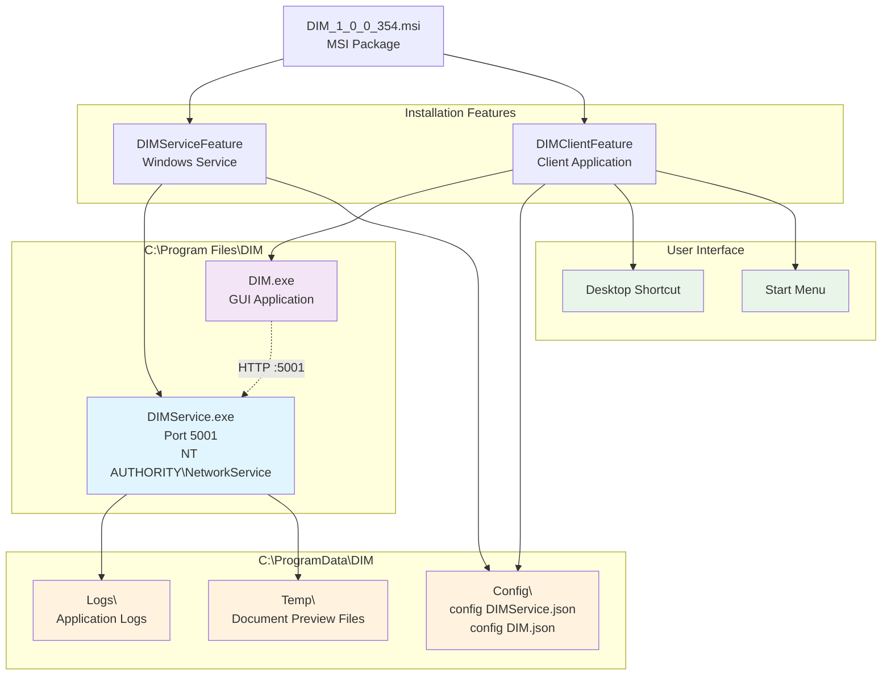
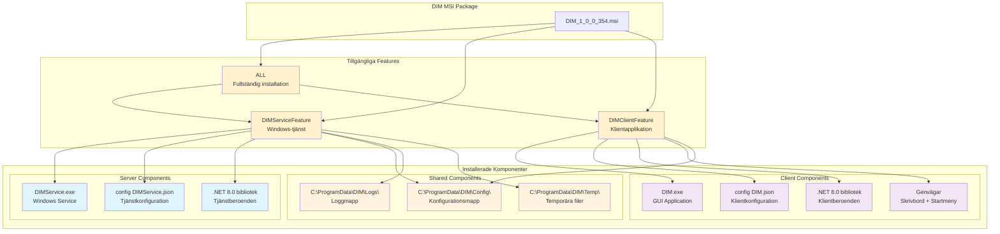
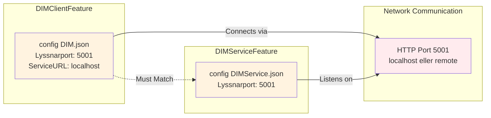
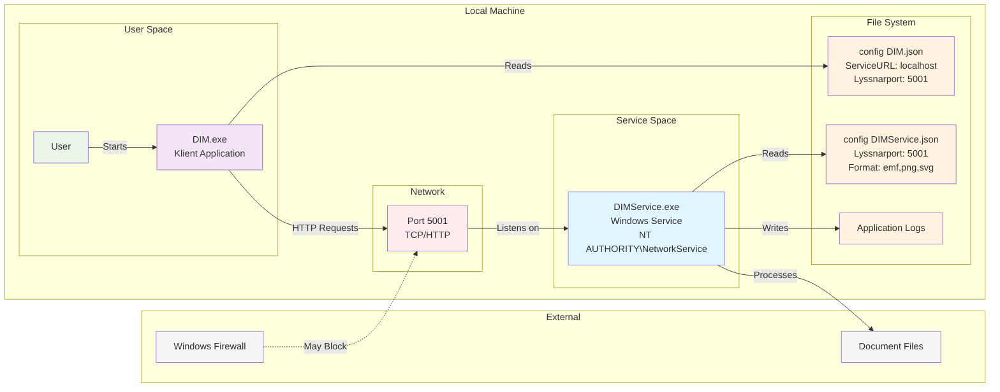

# DIM - Leveransdokumentation för MSI-installation
## Digital Informationsmarkering - Teknikerguide


### Dokumentversion
- **Version:** 1.0
- **Datum:** 2025-07-02
- **Målgrupp:** Tekniker och systemadministratörer
- **Syfte:** Installation, konfiguration och hantering av DIM MSI-paket

---

## 1. Översikt

**För dig som tekniker:** Detta avsnitt ger dig grundläggande förståelse för vad DIM-systemet är, varför det levereras som MSI-paket och vad det innebär för din dagliga drift och underhåll.

### 1.1 Vad är DIM?

**Systemets syfte och funktion:**
DIM (Digital Informationsmarkering) är ett system för att skapa och applicera säkerhetsklassificeringar och markeringar på digitala dokument enligt svenska offentlighets- och sekretesslagen (OSL). Systemet består av två huvudkomponenter som levereras i ett sammanhållet MSI-paket.

#### Varför behövs detta system?

**🏛️ Juridisk grund:**
- Svenska myndigheter är **enligt lag** skyldiga att klassificera dokument korrekt
- **OSL (Offentlighets- och sekretesslagen)** kräver tydlig markering av sekretessgrad
- **Felaktig klassificering** kan leda till juridiska konsekvenser för organisationen
- **Standardiserad markering** säkerställer regelefterlevnad

**📋 Praktisk nytta för organisationer:**
- **Automatiserad process** istället för manuell stämpelhantering
- **Konsekvent utseende** på alla säkerhetsmarkeringar
- **Digital integration** med befintliga dokumentflöden
- **Spårbarhet** av alla säkerhetsklassificeringar

**👥 Vad det innebär för dig som tekniker:**
- Du installerar och underhåller ett **juridiskt kritiskt system**
- **Tillgänglighet är avgörande** - organisationen kan inte klassificera dokument utan systemet
- **Säkerhetsaspekter** måste tas på allvar - felaktig konfiguration kan få juridiska konsekvenser
- **Backup och kontinuitet** är kritiska för verksamheten

### 1.2 Leveransformat

**Varför MSI-paket?**

DIM levereras som en Windows Installer-fil (`.msi`) med namnet `DIM_X_X_X_X.msi` där X_X_X_X representerar versionsnumret med understreck (t.ex. `DIM_1_0_0_354.msi`).

#### Fördelar med MSI för tekniker:

**🔧 Professionell installation:**
- **Windows-standard** för företagsapplikationer
- **Automatisk registrering** av tjänster och komponenter
- **Korrekt filbehörigheter** sätts automatiskt
- **Windows Add/Remove Programs** integration

**📦 Flexibel deployment:**
- **Silent installation** för massutrollning
- **Feature-baserad installation** - välj endast nödvändiga komponenter
- **Kommandoradsparametrar** för automatisering
- **Group Policy deployment** möjlig

**🔄 Pålitlig underhåll:**
- **Versionskontroll** inbyggd i filnamnet
- **Automatisk uppgradering** med major upgrade-logik
- **Ren avinstallation** - inga kvarvarande filer
- **Rollback-möjlighet** vid problem

**⚠️ Vad du behöver veta som tekniker:**
- **Administratörsbehörighet krävs** för installation
- **Endast en version** kan vara installerad åt gången
- **Tjänstestopp** sker automatiskt vid uppgradering
- **Konfigurationsfiler bevaras** vid uppgradering

### 1.3 Systemöversikt

**För tekniker:** Nedanstående diagram visar **exakt vad som installeras** och **var det placeras** när du kör MSI-paketet. Förstå denna struktur för att kunna supportera, felsöka och underhålla systemet effektivt.

#### Vad händer under installationen?

**📥 MSI-paketet** (`DIM_1_0_0_354.msi`) innehåller allt som behövs för en komplett installation, men du kan välja att installera endast de delar du behöver genom att specificera olika "features".

**🎯 Installationsstrategi för olika scenarier:**
- **Lokal installation:** Installera båda komponenter på samma maskin (standard)
- **Endast backend:** Bara DIMService för automatiserade system utan GUI
- **Endast frontend:** Bara DIM-klient som ansluter till extern DIMService

**💡 Viktigt att förstå:** Varje "feature" i MSI:n skapar specifika filer och kataloger. Som tekniker behöver du veta var allt hamnar för att kunna:
- **Felsöka** när något inte fungerar
- **Säkerhetskopiera** kritiska konfigurationer
- **Övervaka** loggfiler och prestanda
- **Rengöra** vid avinstallation eller uppgradering



#### Förklaring av systemstrukturen

**🗂️ Filsystemslayout förklarad för tekniker:**

**Program Files (`C:\Program Files\DIM\`)**
- **Vad:** Själva programfilerna och runtime-bibliotek
- **Behörigheter:** Endast administratörer kan ändra
- **Backup:** Nej, återskapas vid ominstallation
- **Tekniker-tips:** Här ligger .exe-filerna du startar manuellt vid felsökning

**ProgramData (`C:\ProgramData\DIM\`)**
- **Vad:** Konfiguration, loggar och temporära filer
- **Behörigheter:** NetworkService och administratörer har skrivaccess
- **Backup:** JA - kritiskt att säkerhetskopiera Config-mappen
- **Tekniker-tips:** Din viktigaste mapp för felsökning och underhåll

**Användargenvägar**
- **Vad:** Skrivbord och startmeny-genvägar till DIM-klienten
- **Skapas:** Endast om DIMClientFeature installeras
- **Tekniker-tips:** Om genvägar saknas - kontrollera att feature installerades

#### Kommunikationsflöde

**🔄 Hur komponenterna pratar med varandra:**

1. **DIMService** startar automatiskt som Windows-tjänst
2. **Lyssnar på port 5001** för HTTP-anrop
3. **DIM-klient** ansluter via HTTP till localhost:5001
4. **Alla konfigurationer** läses från ProgramData-mappen
5. **Loggar** skrivs automatiskt för felsökning

**⚠️ Kritiska beroenden att övervaka:**
- **Port 5001** måste vara ledig för DIMService
- **NetworkService** måste ha rättigheter till ProgramData
- **Båda komponenter** måste ha samma portkonfiguration
- **Brandvägg** får inte blockera lokal HTTP-trafik

#### Din roll som tekniker efter installation

**🛠️ Vad du behöver göra regelbundet:**
- **Övervaka** att DIMService-tjänsten körs
- **Kontrollera** loggfiler i `C:\ProgramData\DIM\Logs\`
- **Säkerhetskopiera** konfigurationsfiler regelbundet
- **Testa** anslutning mellan klient och tjänst

**🚨 Tecken på problem att hålla utkik efter:**
- DIMService-tjänsten stoppas oväntat
- Felmeddelanden i Windows Event Log
- DIM-klient kan inte ansluta till tjänsten
- Ökande storlek på Temp-mappen (indikerar felhantening)

---

## 2. Systemkomponenter

### 2.1 Vad installeras?

MSI-paketet innehåller två huvudkomponenter som kan installeras separat eller tillsammans:

#### 2.1.1 DIMService (Windows-tjänst)
- **Fil:** `DIMService.exe`
- **Typ:** Windows-tjänst som körs automatiskt
- **Konto:** NT AUTHORITY\\NetworkService
- **Funktion:** Backend-tjänst som hanterar markering av dokument
- **Port:** Lyssnar på port 5001 (konfigurerbar)

#### 2.1.2 DIM (Klientapplikation)
- **Fil:** `DIM.exe`
- **Typ:** Windows-applikation med grafiskt användargränssnitt
- **Funktion:** Frontend för att konfigurera och använda markeringstjänsten
- **Genvägar:** Skapas på skrivbordet och i startmenyn

### 2.2 Inkluderade beroenden
- **.NET 8.0 Runtime:** Self-contained, inga externa .NET-installationer krävs
- **DLL-filer:** Alla nödvändiga bibliotek inkluderas
- **Konfigurationsfiler:** JSON-baserade konfigurationsfiler för båda komponenter

---

## 3. Systemkrav

### 3.1 Hårdvarukrav (minimum)
- **Processor:** x64-kompatibel processor
- **RAM:** 512 MB tillgängligt minne
- **Diskutrymme:** 200 MB ledigt utrymme på systemdisken
- **Nätverk:** Lokal nätverksanslutning (för kommunikation mellan komponenter)

### 3.2 Mjukvarukrav
- **Operativsystem:** Microsoft Windows 10 eller Windows 11 (x64)
- **Behörigheter:** Administratörsbehörighet krävs för installation
- **Brandvägg:** Port 5001 TCP måste vara tillgänglig lokalt

### 3.3 Nätverkskrav
- **Intern kommunikation:** HTTP-kommunikation på port 5001 mellan DIM-klient och DIMService
- **Internetanslutning:** Ej erforderlig för grundfunktionalitet

---

## 4. Installationsplatser och katalogstruktur

### 4.1 Programfiler
```
C:\Program Files\DIM\
├── DIM\                    # Klientapplikation
│   ├── DIM.exe
│   ├── *.dll              # .NET-bibliotek
│   ├── *.json             # Applikationsinställningar
│   └── *.pdb              # Debug-information
└── DIMService\            # Windows-tjänst
    ├── DIMService.exe
    ├── *.dll              # .NET-bibliotek
    ├── *.json             # Tjänstinställningar
    └── *.pdb              # Debug-information
```

### 4.2 Konfigurationsfiler
```
C:\ProgramData\DIM\
└── Config\
    ├── config DIM.json         # Klientkonfiguration
    └── config DIMService.json  # Tjänstkonfiguration
```

### 4.3 Arbetskataloger
```
C:\ProgramData\DIM\
├── Logs\                  # Felloggar och händelseloggar
└── Temp\                  # Temporära filer för dokumentvisning
```

### 4.4 Användargenvägar
- **Skrivbord:** `DIM.lnk` (om DIMClientFeature installeras)
- **Startmeny:** `%ProgramData%\Microsoft\Windows\Start Menu\Programs\DIM\DIM.lnk`

---

## 5. Installationsförfaranden

### 5.1 Installationsflöde


### 5.2 Behörigheter för installation
- **Krävs:** Administratörsbehörighet (UAC-prompt visas)
- **Orsak:** Installation av Windows-tjänst och systemfilkatalogerna
- **Rekommendation:** Kör installation från ett administratörskonto

### 5.3 Enkel installation (rekommenderat för de flesta)

#### Grafisk installation
1. **Högerklicka** på MSI-filen och välj **"Kör som administratör"**
2. **Eller dubbelklicka** på MSI-filen (UAC-prompt visas automatiskt)
3. Följ installationsguiden för att välja komponenter

#### Kommandoradsinstallation med basic UI
```cmd
msiexec /i DIM_1_0_0_354.msi /qb
```

### 5.4 Tysta installationer (för automatisering)

#### Helt tyst installation av alla komponenter
```cmd
msiexec /i DIM_1_0_0_354.msi /qn /L*V install.log
```

#### Tyst installation med loggning och specifika komponenter
```cmd
# Endast Windows-tjänsten
msiexec /i DIM_1_0_0_354.msi /qn ADDLOCAL=DIMServiceFeature /L*V dimservice_install.log

# Endast klientapplikationen
msiexec /i DIM_1_0_0_354.msi /qn ADDLOCAL=DIMClientFeature /L*V dimclient_install.log

# Alla komponenter
msiexec /i DIM_1_0_0_354.msi /qn ADDLOCAL=ALL /L*V dim_full_install.log
```

---

## 6. Installationsalternativ och features

### 6.1 Tillgängliga features

DIM MSI-paketet är uppbyggt med modulära features som gör det möjligt att installera endast de komponenter som behövs för olika scenarier. Detta möjliggör flexibel deployment i olika miljöer.

#### 6.1.1 Feature-översikt



#### 6.1.2 Feature-specifikationer

| Feature | Beskrivning | Komponenter | Användningsscenario |
|---------|-------------|-------------|-------------------|
| **`DIMServiceFeature`** | Backend Windows-tjänst | DIMService.exe, konfiguration, tjänstregistrering | Servermiljöer, headless installation |
| **`DIMClientFeature`** | Frontend GUI-applikation | DIM.exe, genvägar, klientkonfiguration | Användarworkstations, desktop-miljöer |
| **`ALL`** | Komplett systeminstallation | Alla ovanstående komponenter | Fristående arbetsstationer, fullständig setup |

#### 6.1.3 DIMServiceFeature - Windows-tjänst

**Vad installeras:**
- `C:\Program Files\DIM\DIMService\DIMService.exe` - Huvudtjänsten
- `C:\Program Files\DIM\DIMService\*.dll` - .NET 8.0 bibliotek och beroenden
- `C:\Program Files\DIM\DIMService\*.json` - Tjänstens inbäddade konfiguration
- `C:\ProgramData\DIM\Config\config DIMService.json` - Huvudkonfigurationsfil
- `C:\ProgramData\DIM\Logs\` - Loggkatalog
- `C:\ProgramData\DIM\Temp\` - Temporära filer för dokumentprocessning

**Tjänsteregistrering:**
- **Tjänstenamn:** `DIMService`
- **Visningsnamn:** `DIMService`
- **Beskrivning:** `DIM (Digital Informationsmarkering)`
- **Startsätt:** Automatisk start vid systemstart
- **Körkonto:** `NT AUTHORITY\NetworkService`
- **Beroenden:** Inga externa tjänstberoenden

**Funktionalitet:**
- HTTP-server på port 5001 (konfigurerbar)
- REST API för dokumentmarkering
- Stöd för EMF, PNG och SVG-format
- Sekretessklassificering enligt svensk lagstiftning
- Loggning av alla operationer

**Kommandoradsexempel:**
```cmd
# Installera endast Windows-tjänsten
msiexec /i DIM_1_0_0_354.msi /qb ADDLOCAL=DIMServiceFeature

# Tyst installation med loggning
msiexec /i DIM_1_0_0_354.msi /qn ADDLOCAL=DIMServiceFeature /L*V service_install.log

# Installation med anpassad port (kräver manuell konfiguration efter installation)
msiexec /i DIM_1_0_0_354.msi /qb ADDLOCAL=DIMServiceFeature
# Sedan redigera C:\ProgramData\DIM\Config\config DIMService.json
```

**Användningsscenarier:**
- **Serverinstallationer:** Centrala servrar som endast tillhandahåller markerings-API
- **Headless miljöer:** System utan grafiska användargränssnitt
- **Docker/containerisering:** Minimal installation för containeriserade miljöer
- **Load balancing:** Flera tjänstinstanser bakom en load balancer

#### 6.1.4 DIMClientFeature - Klientapplikation

**Vad installeras:**
- `C:\Program Files\DIM\DIM\DIM.exe` - GUI-applikation
- `C:\Program Files\DIM\DIM\*.dll` - .NET 8.0 bibliotek och beroenden
- `C:\Program Files\DIM\DIM\*.json` - Applikationsinställningar
- `C:\ProgramData\DIM\Config\config DIM.json` - Klientkonfigurationsfil
- Skrivbordsgenväg: `DIM.lnk`
- Startmenygenväg: `%ProgramData%\Microsoft\Windows\Start Menu\Programs\DIM\DIM.lnk`

**Funktionalitet:**
- Grafiskt användargränssnitt för dokumentmarkering
- Anslutning till DIMService via HTTP
- Förhandsgranskning av markeringar
- Export till olika filformat
- Konfiguration av standardvärden

**Kommandoradsexempel:**
```cmd
# Installera endast klientapplikationen
msiexec /i DIM_1_0_0_354.msi /qb ADDLOCAL=DIMClientFeature

# Tyst installation utan genvägar (avancerat)
msiexec /i DIM_1_0_0_354.msi /qn ADDLOCAL=DIMClientFeature

# Installation för fjärrserver-anslutning
msiexec /i DIM_1_0_0_354.msi /qb ADDLOCAL=DIMClientFeature
# Sedan redigera C:\ProgramData\DIM\Config\config DIM.json:
# {"Lyssnarport": 5001, "ServiceURL": "dimserver.company.local"}
```

**Användningsscenarier:**
- **Användarworkstations:** Desktop-datorer där användare skapar markeringar
- **Administrativa klienter:** Specialiserade arbetsstationer för dokumenthantering
- **Fjärrklienter:** Klienter som ansluter till central DIMService
- **Testmiljöer:** Utvecklings- och testinstallationer

#### 6.1.5 ALL - Fullständig installation

**Vad installeras:**
- Alla komponenter från både `DIMServiceFeature` och `DIMClientFeature`
- Komplett, fristående DIM-system på en maskin

**Kommandoradsexempel:**
```cmd
# Fullständig installation (standard)
msiexec /i DIM_1_0_0_354.msi /qb

# Explicit full installation
msiexec /i DIM_1_0_0_354.msi /qb ADDLOCAL=ALL

# Tyst full installation med detaljerad loggning
msiexec /i DIM_1_0_0_354.msi /qn ADDLOCAL=ALL /L*V full_install.log
```

**Användningsscenarier:**
- **Fristående arbetsstationer:** Kompletta system där användare både skapar och processar markeringar
- **Utvecklingsmiljöer:** Fullständig installation för utveckling och testning
- **Mindre organisationer:** Enkla installationer där allt körs på samma maskin
- **Pilot-implementationer:** Testa hela systemet innan större deployment

#### 6.1.6 Praktiska kombinationer och exempel

##### Scenario 1: Centraliserad arkitektur
```cmd
# På servern (endast tjänst)
msiexec /i DIM_1_0_0_354.msi /qn ADDLOCAL=DIMServiceFeature /L*V server.log

# På klientdatorer (endast klient)
msiexec /i DIM_1_0_0_354.msi /qn ADDLOCAL=DIMClientFeature /L*V client.log
# Konfigurera klienter att peka på servern:
# ServiceURL: "dimserver.company.local"
```

##### Scenario 2: Fristående installationer
```cmd
# Fullständig installation på varje maskin
msiexec /i DIM_1_0_0_354.msi /qb ADDLOCAL=ALL
```

##### Scenario 3: Gradvis utbyggnad
```cmd
# Steg 1: Installera tjänst först
msiexec /i DIM_1_0_0_354.msi /qb ADDLOCAL=DIMServiceFeature

# Steg 2: Lägg till klient senare (utan avinstallation)
msiexec /i DIM_1_0_0_354.msi /qb ADDLOCAL=DIMClientFeature
# Observera: Detta kommer att lägga till klientfunktionalitet till befintlig installation
```

#### 6.1.7 Feature-beroenden och begränsningar

**Beroendeanalys:**
- `DIMClientFeature` **kan** fungera utan `DIMServiceFeature` (om den ansluter till fjärrserver)
- `DIMServiceFeature` fungerar **oberoende** av `DIMClientFeature`
- Båda features kan installeras **samtidigt** utan konflikter
- Shared components (`C:\ProgramData\DIM\`) skapas av **båda** features

**Konfigurationsberoenden:**


**Viktiga överväganden:**
- **Portkonflikt:** Båda features använder samma standardport (5001)
- **Nätverkskrav:** Klient måste kunna nå tjänsten via HTTP
- **Säkerhet:** Windows Firewall kan blockera kommunikation
- **Versionskompatibilitet:** Klient och tjänst bör ha samma version för optimal kompatibilitet

### 6.2 UI-nivåer för installation

| Parameter | Beskrivning | Användning |
|-----------|-------------|------------|
| `/qn` | Helt tyst installation | Automatisering, inga dialoger |
| `/qb` | Basic UI med progressbar | Halvautomatisk installation |
| `/qb+` | Basic UI + slutdialog | Som `/qb` men med bekräftelse |
| `/qf` | Full UI | Samma som dubbelklick på MSI |

### 6.3 Loggningsalternativ

```cmd
# Fullständig verbose-loggning
/L*V logfil.txt

# Exempel med olika loggningsnivåer
msiexec /i DIM_1_0_0_354.msi /qb /L*V "C:\Temp\DIM_Installation.log"
```

**Rekommendation:** Använd alltid loggning vid automatiserade installationer för felsökning.

---

## 7. Post-installation

### 7.1 Tjänstverifiering
Efter installation, kontrollera att DIMService-tjänsten körs:

```cmd
# Kontrollera tjänststatus
sc query DIMService

# Starta tjänsten manuellt om behov
net start DIMService

# Kontrollera att tjänsten lyssnar på rätt port
netstat -an | findstr :5001
```

### 7.2 Funktionstest
1. **Starta DIM-klienten** från skrivbordsgenvägen eller startmenyn
2. **Kontrollera anslutning** till DIMService (ska visas som "Ansluten" i klientgränssnittet)
3. **Testa grundfunktionalitet** genom att skapa en testmarkering

### 7.3 Brandväggskonfiguration
Om Windows Brandvägg blockerar kommunikation:

```cmd
# Tillåt DIMService genom brandväggen
netsh advfirewall firewall add rule name="DIMService" dir=in action=allow protocol=TCP localport=5001

# Eller via GUI: Windows Säkerhet > Brandvägg och nätverksskydd > Tillåt en app genom brandväggen
```

---

## 8. Konfiguration

### 8.1 Nätverkskommunikation



### 8.2 DIMService-konfiguration
**Fil:** `C:\ProgramData\DIM\Config\config DIMService.json`

**Viktiga inställningar:**
- `Lyssnarport`: Port som tjänsten lyssnar på (standard: 5001)
- `Sekretess`: Definierade säkerhetsklassificeringar och paragrafer
- `Format`: Tillgängliga utdataformat (emf, png, svg)

### 8.3 DIM-klientkonfiguration
**Fil:** `C:\ProgramData\DIM\Config\config DIM.json`

**Viktiga inställningar:**
- `Lyssnarport`: Port för kommunikation med DIMService (måste matcha tjänsten)
- `ServiceURL`: Serveradress för DIMService (standard: "localhost")

### 8.4 Redigering av konfigurationsfiler
⚠️ **VIKTIGT:** Starta om DIMService-tjänsten efter konfigurationsändringar:

```cmd
net stop DIMService
net start DIMService
```

---

## 9. Uppgraderingar

### 9.1 Hur uppgraderingar hanteras
- **UpgradeCode:** MSI-paketet använder en statisk UpgradeCode som säkerställer korrekt uppgraderingshantering
- **ProductCode:** Genereras automatiskt för varje version för att möjliggöra side-by-side-upptäckt
- **MajorUpgrade:** Konfigurerad för automatisk avinstallation av tidigare versioner

### 9.2 Uppgraderingsförfarande

#### Automatisk uppgradering
```cmd
# Installation av ny version avinstallerar automatiskt föregående version
msiexec /i DIM_1_0_1_400.msi /qb /L*V upgrade.log
```

#### Manuell uppgradering
1. **Stoppa DIMService-tjänsten** före uppgradering (rekommenderat)
   ```cmd
   net stop DIMService
   ```
2. **Installera ny MSI-version** enligt instruktioner ovan
3. **Verifiera installation** enligt post-installationsrutiner

### 9.3 Viktiga överväganden vid uppgradering
- **Konfigurationsfiler bevaras:** Befintliga inställningar skrivs inte över
- **Tjänstenamn bibehålls:** DIMService-tjänsten behåller sina inställningar
- **Användardata:** Loggar och temporära filer påverkas inte
- **Downgrades:** Blockeras för säkerhet (AllowDowngrades = false)

---

## 10. Avinstallation

### 10.1 Behörigheter för avinstallation
- **Krävs:** Administratörsbehörighet
- **Automatisk tjänststopp:** DIMService stoppas och avregistreras automatiskt

### 10.2 Avinstallationsmetoder

#### Via kontrollpanelen
1. **Öppna:** Inställningar > Appar > Installerade appar
2. **Sök efter:** "DIM"
3. **Klicka:** Tre punkter > Avinstallera

#### Via kommandoraden
```cmd
# Identifiera ProductCode (från logg eller registret)
msiexec /x {PRODUCT-GUID} /qb /L*V uninstall.log

# Alternativt, med MSI-filen
msiexec /x DIM_1_0_0_354.msi /qb /L*V uninstall.log
```

#### Tyst avinstallation
```cmd
msiexec /x DIM_1_0_0_354.msi /qn /L*V silent_uninstall.log
```

### 10.3 Manuell rensning (om behov)
Om avinstallationen misslyckades eller var ofullständig:

#### Kontrollera att tjänsten är borttagen
```cmd
sc query DIMService
# Ska returnera "service does not exist"
```

#### Kontrollera att filer är borttagna
- `C:\Program Files\DIM\` (ska inte existera)
- `C:\ProgramData\DIM\Config\` (konfigurationsfiler kan finnas kvar)

#### Rensa registret (endast vid problem)
⚠️ **VARNING:** Ändra endast registret om du vet vad du gör

```
HKEY_LOCAL_MACHINE\SOFTWARE\Microsoft\Windows\CurrentVersion\Uninstall\
# Leta efter DIM-relaterade nycklar
```

---

## 11. Felsökning

### 11.1 Vanliga installationsproblem

#### Problem: "Installation misslyckades med felkod 1603"
**Lösning:**
1. Kontrollera att du har administratörsbehörighet
2. Granska installationsloggen för specifika fel
3. Stäng alla DIM-relaterade processer före installation

#### Problem: "DIMService-tjänsten startar inte"
**Lösning:**
1. Kontrollera Windows Event Log
   ```cmd
   eventvwr.msc
   # Navigera till: Windows Logs > Application
   ```
2. Verifiera att port 5001 inte används av annan process
   ```cmd
   netstat -ano | findstr :5001
   ```
3. Kontrollera tjänstekontot och behörigheter

#### Problem: "DIM-klienten kan inte ansluta till tjänsten"
**Lösning:**
1. Kontrollera att DIMService körs
2. Verifiera portinställningar i konfigurationsfiler
3. Kontrollera brandväggsinställningar

### 11.2 Loggfiler och diagnostik

#### Installationsloggar
- **Plats:** Där MSI-filen körs (om `/L*V` använts)
- **Innehåll:** Detaljerad installationsinformation
- **Användning:** Sök efter "error", "failed", "returned 3"

#### Windows Event Log
- **Tjänstefel:** Applications and Services Logs > DIMService (om skapas)
- **Systemfel:** Windows Logs > System
- **Applikationsfel:** Windows Logs > Application

#### DIM-applikationsloggar
- **Plats:** `C:\ProgramData\DIM\Logs\`
- **Format:** Textbaserade loggar med tidsstämpel

### 11.3 Nätverksdiagnostik

```cmd
# Testa lokal anslutning till DIMService
telnet localhost 5001

# Kontrollera lyssningsports
netstat -ano | findstr :5001

# Testa HTTP-anrop (kontrollera att tjänsten körs)
curl http://localhost:5001/isrunning
```

---

## 12. Säkerhet och behörigheter

### 12.1 Tjänstkonto
- **Konto:** NT AUTHORITY\\NetworkService
- **Behörigheter:** Minimal behörighet för tjänstdrift
- **Rekommendation:** Ändra inte tjänstekonto utan särskild anledning

### 12.2 Filsystembehörigheter
- **Programfiler:** Skrivskyddade för användare, full kontroll för administratörer
- **Konfigurationsfiler:** Läs/skriv för tjänstekonto och administratörer
- **Loggkataloger:** Skrivrättigheter för tjänstekonto

### 12.3 Nätverkssäkerhet
- **Port 5001:** Endast lokal bindning som standard
- **HTTP-trafik:** Okrypterad kommunikation lokalt
- **Brandvägg:** Konfigurera enligt organisationens säkerhetspolicy

---

## 13. Support och underhåll

### 13.1 Rutinunderhåll
- **Loggrotation:** Övervaka storleken på logfiler i `C:\ProgramData\DIM\Logs\`
- **Diskutrymme:** Kontrollera temporära filer i `C:\ProgramData\DIM\Temp\`
- **Tjänsteövervakning:** Verifiera regelbundet att DIMService körs

### 13.2 Backup-överväganden
**Kritiska filer för backup:**
- `C:\ProgramData\DIM\Config\config DIMService.json`
- `C:\ProgramData\DIM\Config\config DIM.json`
- Eventuell anpassad konfiguration eller mallar

---

## 14. Support och vidare läsning

### Relaterad dokumentation:
- [`README.md`](../README.md) - Allmän systemöversikt
- [`docs/DIM_Konfigurationsfiler_Tekniker.md`](DIM_Konfigurationsfiler_Tekniker.md) - Konfigurationshantering
- [`docs/DIM_HTTP_Endpoints_Tekniker.md`](DIM_HTTP_Endpoints_Tekniker.md) - HTTP API-endpoints

### Support:
- **Utvecklare:** Dynalab AB    www.dynalab.se
- **MSI-version:** Kontrollera filnamn eller ProductVersion i installationsloggar

**Vid installationsproblem, inkludera:**
- MSI-filnamn och version
- Fullständig installationslogg (`/L*V` output)
- Windows version och arkitektur (x64/x86)
- Beskrivning av försök och felmeddelanden
- Resultat från `msiexec /? ` kommandot

### Versionshistorik:
| Version | Datum | Förändringar |
|---------|--------|--------------|
| 1.0 | 2025-01-02 | Initial version av leveransdokumentation |

 
